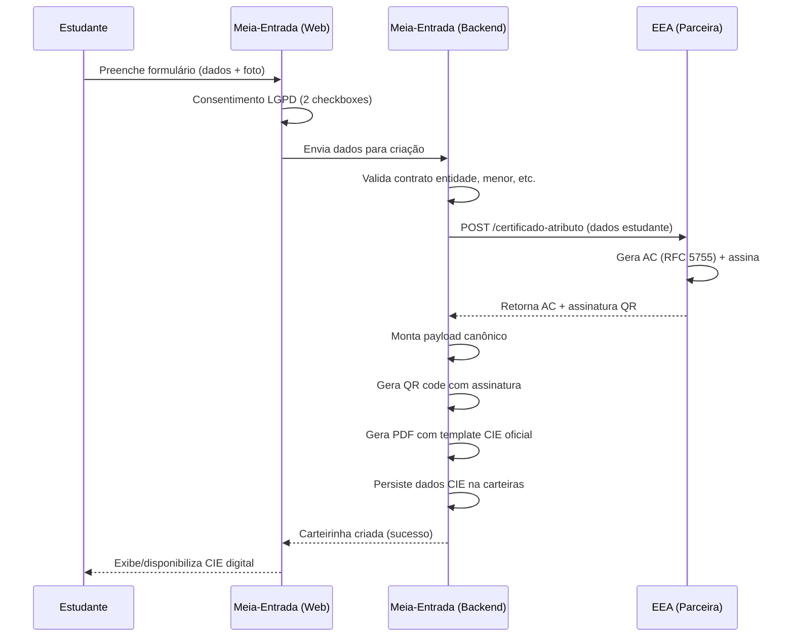

# Requisitos Técnicos CIE v3.3 — Documento de Implementação

> **Data:** 2026-07-03 (versão 1.0)
> **Fontes:** Pesquisa EEA/ICP-Brasil, Plano de Ação (Arquiteto), Auditoria CIE v3.3
> **Propósito:** Servir como especificação técnica detalhada para a migração do sistema atual (carteirinha privada) para conformidade com a CIE v3.3 oficial, incluindo certificado de atributo ICP-Brasil, assinatura criptográfica, QR code normalizado e validação offline/online.

---

## Sumário Executivo

O sistema Meia-Entrada opera hoje com carteirinhas **privadas** — sem Certificado de Atributo ICP-Brasil, sem assinatura criptográfica, com QR code forjável e validação meramente baseada em `SELECT *` no banco. A migração para CIE v3.3 exige uma **nova camada de confiança** baseada na cadeia ICP-Brasil, integração com uma **Entidade Emissora de Atributo (EEA)** credenciada, e alterações profundas no schema, geração de documentos e validação.

Este documento detalha cada requisito técnico, as alternativas de implementação e o plano de migração.

---

## 1. Estrutura do Certificado de Atributo (RFC 5755)

### 1.1 Definição

O **Certificado de Atributo (Attribute Certificate — AC)** é definido pela **RFC 5755** (anula a RFC 3281). Diferente de um certificado X.509 tradicional (que liga uma identidade a uma chave pública), o AC **liga uma identidade a um conjunto de atributos/permissões** — neste caso, a condição de **estudante** para fins de meia-entrada.

O AC é assinado por uma **Entidade Emissora de Atributo (EEA)** credenciada pela ICP-Brasil e referenda-se a um **certificado X.509 tradicional** (do titular ou da EEA) como âncora de confiança.

### 1.2 Campos Obrigatórios (RFC 5755 + ICP-Brasil)

| Campo | Tipo ASN.1 | Obrigatório | Descrição CIE v3.3 |
|---|---|---|---|
| `Version` | `INTEGER` | Sim | `v2` (1) — versão do formato AC |
| `Holder` | `Holder` | Sim | Identificador do titular do atributo. **CPF do estudante** no formato `GeneralNames` ou `IssuerSerial` referenciando o cert. X.509 do titular |
| `Issuer` | `GeneralNames` | Sim | **EEA credenciada** que emitiu o AC. Deve conter OID `2.16.76.1.10` da ICP-Brasil |
| `Signature` | `AlgorithmIdentifier` | Sim | Algoritmo de assinatura (ver §1.3) |
| `SerialNumber` | `INTEGER` | Sim | Número de série único dentro da EEA |
| `AttrCertValidityPeriod` | `AttCertValidityPeriod` | Sim | Período de validade: `notBeforeTime` / `notAfterTime`. **CIE v3.3 exige `notAfter` ≤ 31/03 do ano seguinte à emissão** |
| `Attributes` | `SEQUENCE OF Attribute` | Sim | Lista de atributos do titular. Para CIE: `estudante`, `instituicao`, `curso`, `matricula`, `validade` |
| `IssuerUniqueID` | `UniqueIdentifier` | Não | — |
| `Extensions` | `SEQUENCE OF Extension` | Não | Extensões. **ICP-Brasil exige OID `2.16.76.1.10`** (campo `cab`) |
| `SignatureAlgorithm` | `AlgorithmIdentifier` | Sim | Deve ser idêntico ao campo `Signature` |
| `SignatureValue` | `BIT STRING` | Sim | Assinatura digital do AC |

### 1.3 Algoritmo de Assinatura

| Parâmetro | Mínimo | Recomendado | Observação |
|---|---|---|---|
| **Algoritmo** | RSA 2048 | RSA 3072 ou ECDSA P-256 | ICP-Brasil exige RSA ≥ 2048. ECC está sendo incorporado |
| **Hash** | SHA-256 | SHA-256 ou SHA-384 | SHA-1 descontinuado |
| **Formato** | PKCS#7 / CAdES-BES | CAdES-BES (básico) ou CAdES-T (com carimbo de tempo) | CAdES-BES é suficiente para MVP; CAdES-T adiciona não-repúdio temporal |
| **Padding** | PKCS#1 v1.5 | PSS (RSASSA-PSS) | ICP-Brasil aceita ambos; PSS é mais moderno |
| **Curva ECC** | — | secp256r1 (P-256) | Futuro: ICP-Brasil testa curva brasileira |

**Decisão de implementação:** RSA 2048 + SHA-256 + PKCS#7 (CAdES-BES) é o *path* mais compatível com o ecossistema ICP-Brasil atual. ECDSA pode ser adotado em versão futura.

### 1.4 OID da ICP-Brasil

| OID | Propósito | Obrigatório |
|---|---|---|
| `2.16.76.1.10` | Atributo do Certificado de Atributo ICP-Brasil (campo `cab`) | Sim — identifica o AC como ICP-Brasil |
| `2.16.76.1.11` | Identificador do tipo de atributo (estudante) | Sim |
| `2.16.76.1.12` | Nome da instituição de ensino | Sim |
| `2.16.76.1.13` | Curso do estudante | Sim |
| `2.16.76.1.14` | Matrícula | Sim |
| `2.16.76.1.15` | Validade do atributo | Sim |

### 1.5 Extensões ICP-Brasil Obrigatórias

- **`cab` (OID `2.16.76.1.10`)**: Contém identificador único do Certificado de Atributo no padrão ICP-Brasil.
- **`atributos` (OID `2.16.76.1.11` a `2.16.76.1.15`)**: Extensões específicas para dados do estudante.

### 1.6 Tamanho Típico do AC

| Componente | Tamanho aproximado |
|---|---|
| Cabeçalho ASN.1 + campos fixos | ~200 bytes |
| Atributos (instituição, curso, etc.) | ~300 bytes |
| Chave pública / identificador | ~300 bytes |
| Assinatura RSA 2048 | ~256 bytes |
| **Total** | **~1-2 KB** |

---

## 2. Formato do QR Code

### 2.1 Especificação do Payload (CIE v3.3 — ITI)

O QR Code da CIE v3.3 não deve conter apenas uma URL. O payload deve ser **estruturado e autocontido para validação offline**, contendo dados canônicos e assinatura digital.

### 2.2 Payload Estruturado (Proposto)

```
CIE33:<versao_protocolo>:<tipo_doc>:<id_doc>:<id_eea>:<dados_canon>:<hash_canon>:<algoritmo_hash>:<assinatura_base64>
```

**Campos Obrigatórios:**

| Campo | Descrição | Exemplo | Tamanho (bytes) |
|---|---|---|---|
| `CIE33` | Magic string / protocolo | `CIE33` | 5 |
| `versao_protocolo` | Versão do schema do QR | `01` | 2 |
| `tipo_doc` | Tipo do documento | `CIE` | 3 |
| `id_doc` | UUID v4 do documento (carteirinha) | `a1b2c3d4-...` | 36 |
| `id_eea` | Identificador da EEA credenciada | `EEA-UPEE-001` | 14 |
| `dados_canon` | Payload canônico mínimo em JSON comprimido (ver §2.3) | `{"n":"João","i":"UFSC","v":"20270331"}` | ~80 |
| `hash_canon` | Hash SHA-256 do `dados_canon` em hex | `a1b2...` | 64 |
| `algoritmo_hash` | Identificador do algoritmo | `sha256` | 6 |
| `assinatura_base64` | Assinatura digital do payload canônico (CAdES compacto) em Base64URL | `MEQCI...` | ~344 |

**Tamanho total estimado do payload: ~550-600 bytes** (bem abaixo do limite de 3KB do QR code versão 25+L).

### 2.3 Payload Canônico (dados_canon)

O `dados_canon` é um JSON compacto (sem espaços) contendo **apenas os campos necessários para validação offline**:

```json
{"n":"João Silva","i":"Universidade Federal de Santa Catarina","d":"123.456.789-00","v":"20270331","e":"EEA-UPEE-001"}
```

| Chave | Campo | Tamanho máx. |
|---|---|---|
| `n` | Nome do estudante (sem acentos, uppercase) | 80 chars |
| `i` | Instituição de ensino (sigla ou nome reduzido) | 60 chars |
| `d` | CPF (mascarado: `***.456.789-**` ou completo) | 14 chars |
| `v` | Validade (formato AAAAMMDD) | 8 chars |
| `e` | EEA emissora (identificador) | 20 chars |

### 2.4 Algoritmo de Compressão

Para reduzir o tamanho do QR code e melhorar a escaneabilidade:

| Técnica | Aplicação | Ganho estimado |
|---|---|---|
| **JSON minificado** | Remover espaços do JSON | ~30% |
| **Chaves curtas** | `n` em vez de `nome`, `i` em vez de `instituicao` | ~40% |
| **CPF sem pontuação** | `12345678900` em vez de `123.456.789-00` | ~15% |
| **Base64URL** | Sem padding `=`; sem `+`/`/` | ~2% |
| **Compressão zlib** (opcional) | Comprimir `dados_canon` antes de hash | ~40-50% (payload) |
| **CBOR** (opcional futuro) | Substituir JSON por CBOR | ~20-30% |

**Decisão:** Para MVP, usar JSON minificado + chaves curtas + Base64URL. zlib/CBOR são otimizações futuras.

### 2.5 Algoritmo de Assinatura do QR

A assinatura no QR code deve ser uma **CAdES compacta** do `dados_canon`:

1. Serializar `dados_canon` como string UTF-8
2. Calcular hash SHA-256
3. Assinar hash com chave privada da EEA (RSA 2048, PKCS#1 v1.5 ou PSS)
4. Codificar assinatura em Base64URL (sem padding)
5. Inserir no payload como `assinatura_base64`

### 2.6 Validação Offline via QR

O estabelecimento (ou app validador) pode validar **sem internet**:

1. Parsear o payload `CIE33:...`
2. Extrair `dados_canon` e `assinatura_base64`
3. Recuperar chave pública da EEA (de cache local atualizado periodicamente)
4. Verificar `SHA-256(dados_canon)` contra a assinatura
5. Conferir `validade >= hoje` (formato AAAAMMDD comparável como string)
6. Exibir: **válido** (verde) ou **inválido** (vermelho)

**Cache da chave pública da EEA:** Deve ser atualizado periodicamente (a cada 6-12h) via download da cadeia ICP-Brasil. O app validador pode embutir a chave pública raiz da ICP-Brasil como âncora.

### 2.7 Correção de Erro e Versão do QR

| Parâmetro | Valor | Justificativa |
|---|---|---|
| **Nível de correção** | `quartile` (Q — ~25%) | Equilíbrio entre densidade e resiliência |
| **Versão** | Automática (payload-dependente) | ~3-6 (29x29 a 41x41 módulos) |
| **Formato** | QR Code modelo 2 (ISO/IEC 18004) | Padrão universal |

---

## 3. Fluxo de Emissão

### 3.1 Arquitetura Geral

```
                    ┌──────────────┐
                    │  Estudante   │
                    └──────┬───────┘
                           │ dados + foto
                           ▼
                    ┌──────────────┐
                    │ Meia-Entrada │ (plataforma)
                    │  (frontend)  │
                    └──────┬───────┘
                           │ solicita cert. atributo
                           ▼
                    ┌──────────────┐
                    │     EEA      │ (credenciada ICP-Brasil)
                    │  (parceira)  │
                    └──────┬───────┘
                           │ emite AC assinado
                           ▼
                    ┌──────────────┐
                    │ Meia-Entrada │ (backend)
                    │  (geração)   │
                    └──────┬───────┘
                           │ insere AC + assina QR + gera PDF
                           ▼
                    ┌──────────────┐
                    │  Carteirinha │ (CIE v3.3 oficial)
                    │  (PDF/PNG)   │
                    └──────────────┘
```

### 3.2 Fluxo Detalhado (Passo a Passo)

#### Passo 1 — Coleta de Dados (Meia-Entrada frontend)

- Estudante preenche formulário (já implementado)
- Dados coletados: nome, CPF, RG, data nascimento, filiação, instituição, curso, matrícula, foto
- Consentimento LGPD (L-01, L-02) **deve estar OK** antes da emissão
- Validação de matrícula ativa na instituição

#### Passo 2 — Solicitação de Certificado de Atributo (Meia-Entrada backend → EEA)

- Meia-Entrada monta payload para API REST da EEA:

```json
POST /api/v1/certificado-atributo
{
  "holder": {
    "cpf": "12345678900",
    "nome": "JOÃO SILVA",
    "data_nascimento": "2000-01-15"
  },
  "attribute": {
    "tipo": "estudante",
    "instituicao": "Universidade Federal de Santa Catarina",
    "codigo_inep": "42012345",
    "curso": "Ciência da Computação",
    "matricula": "2024123456",
    "validade": "2027-03-31"
  },
  "plataforma_id": "meia-entrada-001",
  "idempotency_key": "uuid-v4"
}
```

- A EEA valida os dados, verifica a vinculação da entidade emissora (contrato de co-controladora)
- Retorna **sucesso ou erro**; se erro, Meia-Entrada não emite a carteirinha

#### Passo 3 — Emissão do Certificado de Atributo (EEA)

- EEA gera o AC (RFC 5755) com os dados recebidos
- Assina com sua chave privada protegida por HSM
- Retorna para Meia-Entrada:

```json
HTTP 201
{
  "status": "sucesso",
  "certificado_atributo": {
    "formato": "p7b",
    "conteudo_base64": "MIIG3gYJKoZIhvcNAQcCoIIx...",
    "serial_number": "123456",
    "validade_inicio": "2026-07-03T00:00:00Z",
    "validade_fim": "2027-03-31T23:59:59Z",
    "oid": "2.16.76.1.10",
    "eea_id": "EEA-UPEE-001",
    "emissor_cnpj": "00.000.000/0001-00",
    "hash_conteudo": "sha256:a1b2c3d4e5..."
  },
  "idempotency_key": "uuid-v4"
}
```

**Campos persistidos na tabela `carteiras`:** ver §6 (Migração de Schema).

#### Passo 4 — Geração do QR Code Assinado (Meia-Entrada backend)

- Montar `dados_canon` (JSON compacto) com dados do estudante + validade
- Calcular hash SHA-256
- **A assinatura do QR pode ser feita de duas formas:**
  - **(a)** EEA assina o payload e retorna assinatura junto com o AC (mais seguro, mas requer API da EEA)
  - **(b)** Meia-Entrada assina localmente com chave da EEA (requer acesso à chave privada — não recomendado sem HSM/KMS)
- **Recomendação:** usar a opção **(a)** — solicitar à EEA também a assinatura do payload canônico no mesmo request, ou em um segundo endpoint

- Codificar payload completo em Base64URL
- Gerar QR code (nível Q, versão automática)

#### Passo 5 — Geração da Carteirinha Física/Digital (Meia-Entrada backend)

- **Template CIE oficial** (não mais template livre por entidade)
- Campos obrigatórios no layout:
  - Brasão da República
  - Logomarca CIE digital
  - Foto do estudante (3x4, fundo neutro — validar)
  - Nome, instituição, curso, validade
  - QR code de validação
  - Caixa de assinatura digital (hash + timestamp)
  - Número do Certificado de Atributo
  - Código de validação nacional
- **Formatos:** PDF (para download/impressão) + PNG (para versão digital)
- **Assinatura do documento:** CAdES-BES sobre o PDF (assinatura digital embutida ou detached)

#### Passo 6 — Disponibilização (Meia-Entrada plataforma)

- Carteirinha disponível para download na área do estudante
- Carteirinha também enviada por e-mail (PDF + link)
- QR code pode ser exibido em tela (versão digital)

### 3.3 Diagrama de Sequência



### 3.4 Tratamento de Erros

| Erro | Ação | Código HTTP |
|---|---|---|
| EEA retorna erro de validação | Rejeitar emissão; informar estudante | 422 |
| EEA fora do ar (timeout 5s) | Retentar 2x com backoff; rejeitar se persistir | 503 |
| Certificado de atributo inválido | Log + rejeitar; auditoria | 500 |
| Dados inconsistentes (CPF inválido) | Rejeitar; feedback ao estudante | 400 |
| Contrato de entidade vencido | Bloquear emissão; notificar admin | 403 |

---

## 4. Validação Offline e Online

### 4.1 Validação Offline (via QR Code)

**Pré-requisitos no lado do validador:**
- Cache local da cadeia de certificados ICP-Brasil (atualizado a cada 6-12h)
- Cache da chave pública da EEA (pode ser embutida na cadeia ICP-Brasil)
- Relógio sincronizado (NTP) para conferir validade temporal

**Algoritmo:**

```
1. Scanear QR code → extrair payload "CIE33:..."
2. Parsear campos (split por ":")
3. Validar magic string = "CIE33"
4. Validar versão do protocolo compatível (>= "01")
5. Extrair dados_canon e assinatura_base64
6. Recuperar chave pública da EEA (id_eea) do cache local
7. Verificar assinatura:
   a. Calcular SHA-256(dados_canon)
   b. RSA_verify(sha256_hash, assinatura_base64, chave_publica_eea)
8. Parsear dados_canon (JSON)
9. Verificar validade (formato AAAAMMDD >= hoje)
10. Exibir resultado:
    - ✅ Verde: assinatura OK + dentro da validade
    - 🟡 Amarelo: assinatura OK, mas fora da validade (expirado)
    - ❌ Vermelho: assinatura inválida ou dados corrompidos
```

**Tempo estimado:** < 500ms em dispositivo móvel moderno (sem internet).

**Cache offline:**
- A cadeia ICP-Brasil completa tem ~2-5 MB
- Pode ser baixada via app validador ou web worker no background
- Atualização incremental (delta) ideal, mas full refresh é aceitável para MVP

### 4.2 Validação Online (via URL/Endpoint)

**Endpoint:** `https://api.meiaentradaestudantil.com.br/v1/validar-cie`

**Request:**

```
GET /v1/validar-cie?id_doc=a1b2c3d4-...&assinatura=MEQCI...
```

Ou, via POST com payload completo:

```json
POST /v1/validar-cie
{
  "qr_payload": "CIE33:01:CIE:a1b2c3d4:EEA-UPEE-001:..."
}
```

**Response (validação completa):**

```json
HTTP 200
{
  "valido": true,
  "status": "ativo",
  "estudante": {
    "nome": "João Silva",
    "instituicao": "UFSC",
    "curso": "Ciência da Computação"
  },
  "validade": "2027-03-31",
  "certificado_atributo": {
    "serial": "123456",
    "oid": "2.16.76.1.10",
    "eea": "EEA-UPEE-001",
    "validade_inicio": "2026-07-03",
    "validade_fim": "2027-03-31"
  },
  "revogado": false,
  "crl_consultada": "2026-07-03T10:00:00Z",
  "cadeia_validada": true,
  "cadeia": [
    "AC Raiz ICP-Brasil",
    "AC IEEA-Raiz",
    "EEA-UPEE-001"
  ],
  "timestamp_consulta": "2026-07-03T14:30:00Z",
  "expirado": false
}
```

**Validações realizadas online (adicionais ao offline):**

| Verificação | Online | Offline |
|---|---|---|
| Assinatura do QR | ✅ | ✅ |
| Validade temporal | ✅ | ✅ |
| Status de revogação (CRL/OCSP) | ✅ | ❌ (cache eventual) |
| Cadeia completa ICP-Brasil | ✅ | ✅ (cache local) |
| Integridade do AC | ✅ | ❌ (só hash do payload) |
| Carimbo de tempo (se CAdES-T) | ✅ | ❌ (precisa conexão) |
| Dados atualizados do estudante | ✅ | ❌ |

### 4.3 Endpoint de Validação Atual (para compatibilidade)

O endpoint existente `GET /V/{token}` deve ser mantido durante a migração, mas **modificado para**:

- Expor **apenas os dados mínimos de validação** (não CPF/RG/filiação)
- Exigir que `token` seja um identificador criptográfico (não `base36(timestamp)`)
- Incluir informações de status CIE v3.3 no response
- **Cache-Control: no-store**
- Rate-limit: 100 req/min por IP

### 4.4 App Validador (Decisão D-3)

| Opção | Prós | Contras |
|---|---|---|
| **PWA Web** | Zero instalação; atualização automática | Depende de navegador; menos recursos nativos |
| **App Nativo** | Câmera otimizada; cache local robusto | Distribuição + manutenção |
| **Integração ANPG** | Segue padrão oficial | Depende de ANPG; sem controle |

**Decisão:** PWA Web para MVP (menor atrito). App nativo em S5 se exigido por estabelecimentos.

### 4.5 UX do Validador

```
┌──────────────────────┐
│   Validador CIE      │
│                      │
│   ┌──────────────┐   │
│   │   [CÂMERA]   │   │
│   │  Escaneie o  │   │
│   │   QR Code    │   │
│   └──────────────┘   │
│                      │
│   ✅ VÁLIDO          │
│   João Silva         │
│   UFSC               │
│   Validade: 31/03/27 │
│   EEA: UPEE-001      │
│                      │
└──────────────────────┘
```

---

## 5. CRL e Renovação

### 5.1 Lista de Certificados Revogados (CRL)

**Obrigação da EEA:** manter e publicar uma LCR (Lista de Certificados Revogados) — também chamada CRL (Certificate Revocation List) ou LCAR (Lista de Certificados de Atributo Revogados).

**Especificação:**

| Parâmetro | Valor |
|---|---|
| **Formato** | X.509 CRL v2 (RFC 5280) |
| **Publicação** | URL pública HTTPS (endpoint da EEA) |
| **Frequência** | Atualização mínima diária; imediata para revogações urgentes |
| **Cache** | Mínimo 6h entre consultas; validade máxima no campo `nextUpdate` |
| **Assinatura** | Pela mesma chave da EEA que emite os ACs |
| **Campos** | `serialNumber` do AC revogado, `revocationDate`, `reasonCode` (opcional) |

**Campos de uma entrada de CRL:**

| Campo | Obrigatório | Descrição |
|---|---|---|
| `userCertificate` | Sim | Número de série do AC revogado |
| `revocationDate` | Sim | Data/hora da revogação |
| `reasonCode` | Não | Código do motivo (keyCompromise, affiliationChanged, superseded, cessationOfOperation, certificateHold) |

### 5.2 Motivos de Revogação (CIE)

| Motivo | Exemplo | Impacto |
|---|---|---|
| `cessationOfOperation` | Estudante cancelou matrícula | Carteirinha inválida |
| `superseded` | Emissão de nova carteirinha (substituição) | Anterior inválida |
| `affiliationChanged` | Estudante transferiu de instituição | Carteirinha anterior inválida |
| `keyCompromise` | Chave da EEA comprometida | **TODAS** as carteirinhas afetadas |
| `certificateHold` | Suspeita de fraude (temporário) | Suspensão até investigação |

### 5.3 Consulta de CRL no Fluxo de Validação

**Online:**
1. Obter URL da CRL da EEA (do `id_eea` no AC ou do endpoint de validação)
2. Baixar CRL (se cache expirado)
3. Buscar `serialNumber` do AC na lista
4. Se encontrado → carteirinha **INVÁLIDA** (rejeitada)
5. Se não encontrado → carteirinha **VÁLIDA** (prosseguir verificação)

**Offline:**
- Cache local da CRL (atualizado a cada pull da cadeia)
- Se CRL cacheado expirado → exibir **🟡 Amarelo** (não foi possível verificar revogação)
- Se CRL cacheado indica revogado → exibir **❌ Vermelho**

### 5.4 Renovação

**Ciclo de vida da CIE v3.3:**

```
Emissão → Válida → Próximo da expiração (30d) → Renovação → Nova CIE
                                                ↘ Expiração → Inválida
         ↘ Fraude/desistência → Revogação → CRL → Inválida
```

**Renovação Automática:**
- 30 dias antes do vencimento (31/03), sistema notifica estudante
- Estudante confirma dados atuais (matrícula ativa? instituição?)
- Novo AC é solicitado à EEA (passo 2 do fluxo)
- Nova carteirinha é gerada (passo 4 e 5)
- Carteirinha anterior é marcada como `superseded` na CRL da EEA

**Renovação Manual:**
- Estudante pode solicitar renovação a qualquer momento (troca de instituição, perda da carteirinha)
- Novo AC emitido, anterior revogado (`superseded`)

### 5.5 Tabela de Status da Carteirinha

| Status | Significado | Display |
|---|---|---|
| `ativa` | AC válido, CRL limpa, dentro da validade | ✅ Válida |
| `expirada` | Fora da validade (>31/03) | 🟡 Expirada |
| `revogada` | AC consta na CRL da EEA | ❌ Revogada |
| `suspensa` | AC em `certificateHold` | 🟡 Suspensa |
| `pendente_renovacao` | <30d para expirar | 🟡 Renove em breve |

### 5.6 Tabela `cie_revogacoes` (schema novo)

```sql
CREATE TABLE IF NOT EXISTS "public"."cie_revogacoes" (
    "id" UUID PRIMARY KEY DEFAULT gen_random_uuid(),
    "carteira_id" UUID NOT NULL REFERENCES "public"."carteiras"("id"),
    "motivo" TEXT NOT NULL,
    "detalhes" TEXT,
    "solicitado_por" UUID NOT NULL REFERENCES "public"."users"("id"),
    "crl_confirmada_em" TIMESTAMPTZ,         -- quando a EEA confirmou na CRL
    "created_at" TIMESTAMPTZ DEFAULT now()
);

CREATE INDEX idx_cie_revogacoes_carteira ON "public"."cie_revogacoes"("carteira_id");
```

---

## 6. Migração do Schema Atual para CIE

### 6.1 Tabela `entidades` — Novos Campos

```sql
ALTER TABLE "public"."entidades" ADD COLUMN IF NOT EXISTS "cnpj" TEXT;
ALTER TABLE "public"."entidades" ADD COLUMN IF NOT EXISTS "codigo_inep" TEXT;
ALTER TABLE "public"."entidades" ADD COLUMN IF NOT EXISTS "codigo_mec" TEXT;
ALTER TABLE "public"."entidades" ADD COLUMN IF NOT EXISTS "ieea_id" TEXT;          -- identificador EEA credenciada
ALTER TABLE "public"."entidades" ADD COLUMN IF NOT EXISTS "url_validacao_oficial" TEXT;
ALTER TABLE "public"."entidades" ADD COLUMN IF NOT EXISTS "responsavel_legal_nome" TEXT;
ALTER TABLE "public"."entidades" ADD COLUMN IF NOT EXISTS "responsavel_legal_cpf" TEXT;
ALTER TABLE "public"."entidades" ADD COLUMN IF NOT EXISTS "contrato_co_controladora_id" UUID REFERENCES "public"."lgpd_contracts"("id");
ALTER TABLE "public"."entidades" ADD COLUMN IF NOT EXISTS "eea_contrato_id" TEXT;  -- ID do contrato com a EEA
ALTER TABLE "public"."entidades" ADD COLUMN IF NOT EXISTS "cie_habilitada" BOOLEAN DEFAULT false;
ALTER TABLE "public"."entidades" ADD COLUMN IF NOT EXISTS "cie_habilitada_em" TIMESTAMPTZ;
```

### 6.2 Tabela `carteiras` — Novos Campos CIE

```sql
-- Versão CIE do documento
ALTER TABLE "public"."carteiras" ADD COLUMN IF NOT EXISTS "cie_versao" TEXT;          -- ex.: "3.3"

-- Certificado de Atributo (retorno da EEA)
ALTER TABLE "public"."carteiras" ADD COLUMN IF NOT EXISTS "certificado_atributo_base64" TEXT;  -- AC em Base64 (formato .p7b)
ALTER TABLE "public"."carteiras" ADD COLUMN IF NOT EXISTS "certificado_atributo_serial" TEXT;  -- serial number do AC
ALTER TABLE "public"."carteiras" ADD COLUMN IF NOT EXISTS "certificado_atributo_oid" TEXT;     -- "2.16.76.1.10"
ALTER TABLE "public"."carteiras" ADD COLUMN IF NOT EXISTS "certificado_atributo_eea_id" TEXT; -- "EEA-UPEE-001"
ALTER TABLE "public"."carteiras" ADD COLUMN IF NOT EXISTS "certificado_atributo_validade_inicio" TIMESTAMPTZ;
ALTER TABLE "public"."carteiras" ADD COLUMN IF NOT EXISTS "certificado_atributo_validade_fim" TIMESTAMPTZ;

-- Assinatura CAdES do documento CIE
ALTER TABLE "public"."carteiras" ADD COLUMN IF NOT EXISTS "assinatura_digital_base64" TEXT;   -- assinatura CAdES do PDF/PNG
ALTER TABLE "public"."carteiras" ADD COLUMN IF NOT EXISTS "hash_documento" TEXT;              -- SHA-256 do PDF gerado

-- QR Code
ALTER TABLE "public"."carteiras" ADD COLUMN IF NOT EXISTS "qr_payload" TEXT;                 -- payload completo do QR
ALTER TABLE "public"."carteiras" ADD COLUMN IF NOT EXISTS "qr_assinatura_base64" TEXT;        -- assinatura compacta do payload
ALTER TABLE "public"."carteiras" ADD COLUMN IF NOT EXISTS "dados_canon_json" TEXT;            -- JSON canônico (para re-exibição)

-- Código de validação nacional
ALTER TABLE "public"."carteiras" ADD COLUMN IF NOT EXISTS "codigo_validacao_nacional" TEXT;   -- UUID específico CIE

-- Status CIE
ALTER TABLE "public"."carteiras" ADD COLUMN IF NOT EXISTS "cie_status" TEXT                   -- 'ativa','expirada','revogada','suspensa'
    DEFAULT 'ativa';
ALTER TABLE "public"."carteiras" ADD COLUMN IF NOT EXISTS "cie_revogada_em" TIMESTAMPTZ;
ALTER TABLE "public"."carteiras" ADD COLUMN IF NOT EXISTS "cie_revogada_motivo" TEXT;
ALTER TABLE "public"."carteiras" ADD COLUMN IF NOT EXISTS "cie_emitida_em" TIMESTAMPTZ DEFAULT now();
ALTER TABLE "public"."carteiras" ADD COLUMN IF NOT EXISTS "cie_ultima_verificacao" TIMESTAMPTZ;

-- Token de validação (substituir base36 por criptográfico)
ALTER TABLE "public"."carteiras" ADD COLUMN IF NOT EXISTS "validation_token" TEXT;             -- PASETO/JWT assinado
```

### 6.3 Migration Completa (SQL)

Migration: `20260703100006_cie_fields_carteiras.sql`

```sql
-- Migration: Adicionar campos CIE v3.3 à tabela carteiras
-- Execute somente após decisão D-1 (EEA contratada)

BEGIN;

-- 1. Campos do Certificado de Atributo
ALTER TABLE "public"."carteiras" ADD COLUMN IF NOT EXISTS "cie_versao" TEXT;
ALTER TABLE "public"."carteiras" ADD COLUMN IF NOT EXISTS "certificado_atributo_base64" TEXT;
ALTER TABLE "public"."carteiras" ADD COLUMN IF NOT EXISTS "certificado_atributo_serial" TEXT;
ALTER TABLE "public"."carteiras" ADD COLUMN IF NOT EXISTS "certificado_atributo_oid" TEXT;
ALTER TABLE "public"."carteiras" ADD COLUMN IF NOT EXISTS "certificado_atributo_eea_id" TEXT;
ALTER TABLE "public"."carteiras" ADD COLUMN IF NOT EXISTS "certificado_atributo_validade_inicio" TIMESTAMPTZ;
ALTER TABLE "public"."carteiras" ADD COLUMN IF NOT EXISTS "certificado_atributo_validade_fim" TIMESTAMPTZ;

-- 2. Assinatura CAdES
ALTER TABLE "public"."carteiras" ADD COLUMN IF NOT EXISTS "assinatura_digital_base64" TEXT;
ALTER TABLE "public"."carteiras" ADD COLUMN IF NOT EXISTS "hash_documento" TEXT;

-- 3. QR Code
ALTER TABLE "public"."carteiras" ADD COLUMN IF NOT EXISTS "qr_payload" TEXT;
ALTER TABLE "public"."carteiras" ADD COLUMN IF NOT EXISTS "qr_assinatura_base64" TEXT;
ALTER TABLE "public"."carteiras" ADD COLUMN IF NOT EXISTS "dados_canon_json" TEXT;

-- 4. Código de validação nacional
ALTER TABLE "public"."carteiras" ADD COLUMN IF NOT EXISTS "codigo_validacao_nacional" TEXT;

-- 5. Status CIE
ALTER TABLE "public"."carteiras" ADD COLUMN IF NOT EXISTS "cie_status" TEXT DEFAULT 'ativa';
ALTER TABLE "public"."carteiras" ADD COLUMN IF NOT EXISTS "cie_revogada_em" TIMESTAMPTZ;
ALTER TABLE "public"."carteiras" ADD COLUMN IF NOT EXISTS "cie_revogada_motivo" TEXT;
ALTER TABLE "public"."carteiras" ADD COLUMN IF NOT EXISTS "cie_emitida_em" TIMESTAMPTZ DEFAULT now();
ALTER TABLE "public"."carteiras" ADD COLUMN IF NOT EXISTS "cie_ultima_verificacao" TIMESTAMPTZ;

-- 6. Token de validação (PASETO ou JWT assinado)
ALTER TABLE "public"."carteiras" ADD COLUMN IF NOT EXISTS "validation_token" TEXT;

-- Índices
CREATE INDEX IF NOT EXISTS idx_carteiras_cie_status ON "public"."carteiras"("cie_status");
CREATE INDEX IF NOT EXISTS idx_carteiras_cert_serial ON "public"."carteiras"("certificado_atributo_serial");
CREATE INDEX IF NOT EXISTS idx_carteiras_cod_validacao ON "public"."carteiras"("codigo_validacao_nacional");

-- Nota: não remover colunas existentes para manter compatibilidade retroativa

COMMIT;
```

### 6.4 Tabela `cie_emissao_log` (Auditoria)

```sql
CREATE TABLE IF NOT EXISTS "public"."cie_emissao_log" (
    "id" UUID PRIMARY KEY DEFAULT gen_random_uuid(),
    "carteira_id" UUID NOT NULL REFERENCES "public"."carteiras"("id"),
    "acao" TEXT NOT NULL,                    -- 'emitida', 'revogada', 'renovada', 'verificada'
    "eea_id" TEXT NOT NULL,                  -- identificador da EEA
    "certificado_serial" TEXT,                -- serial do AC emitido/revogado
    "hash_estado_anterior" TEXT,             -- hash do estado da carteira antes da ação
    "realizado_por" UUID REFERENCES "public"."users"("id"),  -- usuário que realizou (se aplicável)
    "ip_origem" TEXT,
    "created_at" TIMESTAMPTZ DEFAULT now()
);

CREATE INDEX IF NOT EXISTS idx_cie_emissao_log_carteira ON "public"."cie_emissao_log"("carteira_id");
CREATE INDEX IF NOT EXISTS idx_cie_emissao_log_eea ON "public"."cie_emissao_log"("eea_id");
```

### 6.5 Compatibilidade Retroativa

- As carteirinhas existentes (sem campos CIE) continuam funcionando como documentos privados
- O campo `cie_versao` nulo indica "não-CIE"
- O endpoint `/V/{token}` atual deve ser mantido durante a transição, mas modificado para não expor dados sensíveis (CPF, RG, filiação)
- **Feature flag:** bloquear emissão de carteirinhas CIE até que a integração com EEA esteja completa

### 6.6 Feature Flag

```sql
-- Tabela para feature flags
INSERT INTO "public"."feature_flags" ("key", "value", "enabled")
VALUES ('cie_v3.3_emitir', 'false', false),
       ('cie_v3.3_validar', 'false', false)
ON CONFLICT ("key") DO NOTHING;
```

---

## 7. Alternativas de Implementação (Bibliotecas Node.js)

### 7.1 Assinatura Criptográfica (CAdES / PKCS#7)

| Biblioteca | Tipo | Funcionalidades | Licença | Pontos Fortes | Pontos Fracos |
|---|---|---|---|---|---|
| **node-forge** | JS pura | Criação/verificação PKCS#7, ASN.1, RSA, X.509 | BSD | Zero dependências nativas; amplamente testada | Performática para lotes; sem CAdES-T nativo |
| **pkijs** | JS pura (ES6) | CAdES, CAdES-T, CAdES-A, ASN.1 completo | MIT | Suporte moderno a CAdES; usado em certificação digital brasileira | Curva de aprendizado maior; documentação técnica |
| **node-rsa** | JS pura | RSA (sign/verify) | MIT | Simples para operações RSA isoladas | Não faz CAdES; só assinatura bruta |
| **crypto (nativo)** | Nativo (Node.js) | RSA, ECDSA, hash, X.509 | MIT (built-in) | Zero dependências; performático | Não implementa CAdES; requer montagem manual do PKCS#7 |
| **cades-plugin** | Bridge | Integração com plugin ICP-Brasil desktop | Proprietária | Usa AC instalado no SO | Depende de plugin externo; não é server-side |
| **webcrypto (Web API)** | Nativo (browser) | RSA, ECDSA, hash | W3C | Suportado em navegadores modernos | Limitado a browser; sem CAdES |
| **openpgp.js** | JS pura | OpenPGP (não CAdES) | LGPL | Alternativa assimétrica | ❌ Não compatível com ICP-Brasil |

### 7.2 Recomendação: `node-forge` + `crypto` (nativo)

**Stack recomendada para MVP:**

```
Assinatura RSA:     crypto (nativo) — sign/verify
PKCS#7/CAdES:       node-forge — montagem do envelope PKCS#7
Parse ASN.1:        node-forge — decode do AC
Hash:               crypto (nativo) — SHA-256
Geração QR Code:    qrcode (npm) — QR em Base64/Buffer
```

**Justificativa:**
- `node-forge` é a biblioteca mais madura em JS para PKCS#7 sem dependências nativas
- `crypto` (nativo) é mais rápido para as operações pesadas (sign/verify)
- Combinação cobre 100% do necessário para MVP
- Sem dependência de HSM no MVP (usar KMS/AWS KMS + chave RSA do KMS via `crypto`)
- PKIjs seria a escolha para implementação mais completa de CAdES-T/CAdES-A se necessário

### 7.3 Alternativa: KMS (AWS KMS / Google Cloud KMS)

| Provedor | Funcionalidade | Custo |
|---|---|---|
| **AWS KMS** | `Sign` (RSASSA_PKCS1_V1_5_SHA_256) | ~$0.03/10k operações + $1/mês por chave |
| **Google Cloud KMS** | `AsymmetricSign` (RSA 2048 + SHA-256) | ~$0.06/10k operações |
| **Azure Key Vault** | `Sign` (RS256) | ~$0.03/10k operações |
| **Hashicorp Vault** | Transit engine (RSA sign) | Custo de infra próprio |

**Fluxo com KMS:**
```javascript
// Exemplo conceitual com AWS KMS
import { KMSClient, SignCommand } from "@aws-sdk/client-kms";

async function signPayload(dadosCanon, kmsKeyId) {
  const client = new KMSClient({ region: "us-east-1" });
  const hash = crypto.createHash("sha256").update(dadosCanon).digest();
  const cmd = new SignCommand({
    KeyId: kmsKeyId,
    Message: hash,
    MessageType: "DIGEST",
    SigningAlgorithm: "RSASSA_PKCS1_V1_5_SHA_256",
  });
  const response = await client.send(cmd);
  return response.Signature.toString("base64");
}
```

### 7.4 Geração de Certificado de Atributo (AC)

**Importante:** A Meia-Entrada **não** gera o AC — quem gera é a **EEA credenciada**. A Meia-Entrada apenas **recebe** e armazena o AC.

A biblioteca para gerar AC seria usada apenas se a Meia-Entrada operasse como EEA (opção (a) do ADR D-1), o que não é recomendado.

### 7.5 Geração de QR Code

| Biblioteca | Funcionalidades | Licença | Notas |
|---|---|---|---|
| **qrcode (npm)** | QR em DataURL/Buffer/SVG | MIT | Padrão da indústria; suporta nível Q e versão automática |
| **qr-image** | QR em PNG/SVG/PDF | MIT | Alternativa leve |
| **jsqrcode** | Leitor de QR (client-side) | Apache 2.0 | Para o validador PWA |

**Uso da biblioteca `qrcode`:**

```javascript
import QRCode from "qrcode";

const payload = buildCIEPayload(dadosCanon, assinaturaBase64);
const qrDataUrl = await QRCode.toDataURL(payload, {
  errorCorrectionLevel: "Q",  // quartile (~25%)
  version: undefined,          // automático
  scale: 4,                    // resolução do PNG
  margin: 2,                   // quiet zone
  type: "image/png",
});
```

### 7.6 Validação Offline (App Validador / PWA)

| Biblioteca | Propósito | Notas |
|---|---|---|
| **jsrsasign** | Verificação de assinatura RSA/PKCS#7 no browser | Leve (~50KB gzip) |
| **pki.js (browser)** | Cadeia de certificados, OCSP, CRL | Completa mas mais pesada |
| **Web Crypto API** | `subtle.verify()` nativo | Suportado em browsers modernos |
| **qrcode-reader (browser)** | Leitura de QR pela câmera | `jsQR` ou `quirc` via WASM |

**Função de validação offline (browser):**

```javascript
async function validarCIEOnline(qrPayload) {
  // 1. Parsear payload
  const parts = qrPayload.split(":");
  if (parts[0] !== "CIE33") throw new Error("Formato inválido");

  const dadosCanon = parts[5];  // JSON compacto
  const assinatura = parts[7];  // Base64URL
  const chavePublica = await getChavePublicaEEA(parts[4]);  // cache IndexedDB

  // 2. Verificar assinatura com Web Crypto
  const encoder = new TextEncoder();
  const data = encoder.encode(dadosCanon);
  const signature = base64urlToArrayBuffer(assinatura);

  const key = await crypto.subtle.importKey(
    "spki", chavePublica, { name: "RSA-PSS", hash: "SHA-256" }, false, ["verify"]
  );

  const isValid = await crypto.subtle.verify(
    { name: "RSA-PSS", saltLength: 32 }, key, signature, data
  );

  // 3. Verificar validade
  const json = JSON.parse(dadosCanon);
  const hoje = new Date().toISOString().slice(0, 10).replace(/-/g, "");
  const expirado = json.v < hoje;

  return { valido: isValid, expirado };
}
```

### 7.7 Dependências Node.js (package.json — backend)

```json
{
  "dependencies": {
    "node-forge": "^1.3.1",
    "qrcode": "^1.5.3",
    "jsonwebtoken": "^9.0.0",
    "uuid": "^9.0.0"
  },
  "devDependencies": {
    "@aws-sdk/client-kms": "^3.500.0",
    "@types/node-forge": "^1.3.0",
    "@types/qrcode": "^1.5.0"
  }
}
```

---

## 8. Cronograma e Dependências

### 8.1 Dependências Externas (Bloqueantes)

| ID | Dependência | Responsável | Prazo estimado | Impacto se não resolvido |
|---|---|---|---|---|
| **D-1** | Decisão: EEA própria vs terceira vs documento privado | CEO/Fundador | 45 dias | Toda a migração CIE bloqueada |
| **D-3** | Decisão: validador PWA vs app nativo vs ANPG | Produto | 90 dias | MVP pode seguir com PWA |
| **EEA** | Contrato com EEA credenciada | CEO + Jurídico | 45-90 dias | Impossível emitir AC |
| **API EEA** | Documentação da API REST da EEA | EEA parceira | Após contrato | Impossível integrar |
| **ITI/MEC** | Validação / homologação do ITI | ITI + Meia-Entrada | 30-60 dias após implementação | CIE não oficial |

### 8.2 Roadmap em Sprints

| Sprint | Período | Escopo CIE | Artefatos | Dependências |
|---|---|---|---|---|
| **S3** | 45 dias | **Decisão EEA + schema + POC** | ADR D-1; schema estendido; POC assinatura; contrato EEA | D-1 |
| **S4** | 60 dias | **Integração EEA + geração CIE** | API client EEA; pipeline assinatura QR; template CIE oficial; geração PDF assinado | S3, API EEA |
| **S4b** | 30 dias | **Validador PWA** | Rota de validação online; PWA validador com câmera; cache offline | S4 |
| **S5** | 30 dias | **Homologação + CRL + auditoria** | Consulta CRL online; `cie_emissao_log`; revogação; testes E2E | S4, S4b |
| **S5+** | 30 dias | **Lançamento + monitoramento** | Feature flag CIE on; migração gradual; treinamento; documentação | S5 |

### 8.3 Marcos (Milestones)

| Marco | Data estimada | Critério de sucesso |
|---|---|---|
| **M1** — Contrato EEA assinado | D+45 | Contrato + SLA + custo por certificado acordados |
| **M2** — Schema CIE migrado | D+50 | Migration SQL executada; feature flags criadas |
| **M3** — POC assinatura funcional | D+55 | 1 carteirinha CIE gerada (teste) com AC + QR assinado |
| **M4** — Integração EEA completa | D+90 | Pipeline de emissão funcional com AC real |
| **M5** — CIE oficial emitida | D+120 | 1ª carteirinha CIE válida gerada e validável offline |
| **M6** — Go-live | D+150 | Feature flag liberada para entidades piloto |

---

## 9. Riscos Técnicos e Mitigações

| Risco | Probabilidade | Impacto | Mitigação |
|---|---|---|---|
| EEA parceira não oferece API REST | Média | Alto | Exigir API no contrato; alternativa: EEA diferente |
| Latência da API da EEA (>2s) | Média | Médio | Cache de AC; timeout de 5s com retry; fila assíncrona |
| Custo do certificado de atributo inviável (>R$10/un) | Média | Alto | Negociar volume; calcular repasse no pricing; considerar EEA própria a longo prazo |
| QR code muito denso (difícil escaneamento) | Baixa | Médio | Compressão do payload; teste com câmeras reais; nível Q |
| Chave privada da EEA exposta | Baixa | Crítico | EEA com HSM obrigatório; contrato com cláusula de segurança |
| Quebra de compatibilidade com carteiras existentes | Média | Médio | Feature flag; manter endpoint antigo durante transição |
| Navegador sem suporte a Web Crypto para validação offline | Baixa | Baixo | Fallback para jsrsasign; suporte a IE não necessário |

---

## 10. Checklist de Implementação

### Pré-requisitos (S3)

- [ ] ADR D-1 aprovado (caminho EEA)
- [ ] Contrato com EEA credenciada assinado
- [ ] Documentação da API da EEA disponível
- [ ] Schema estendido (migration SQL executada em staging)
- [ ] POC de assinatura RSA com `node-forge` + `crypto` funcional

### Integração (S4)

- [ ] API client para EEA (solicitar AC)
- [ ] Pipeline de montagem do payload canônico
- [ ] Geração de QR code com assinatura (CAdES compacta)
- [ ] Template CIE oficial (SVG → PDF)
- [ ] Assinatura CAdES do PDF
- [ ] Rota de validação online (`/v1/validar-cie`)
- [ ] PWA validador com leitura de QR + verificação offline
- [ ] Cache offline da cadeia ICP-Brasil
- [ ] Rate-limit e proteção no endpoint de validação

### Finalização (S5)

- [ ] CRL consulta integrada
- [ ] Log de emissão (`cie_emissao_log`)
- [ ] Fluxo de revogação
- [ ] Notificação de renovação automática
- [ ] Testes E2E de emissão + validação
- [ ] Testes de carga (concorrência de emissão)
- [ ] Documentação de operação
- [ ] Treinamento da equipe

---

## 11. Referências

| Documento | Fonte |
|---|---|
| RFC 5755 — Attribute Certificate Profile | IETF |
| DOC-ICP-16 — Certificado de Atributo ICP-Brasil | ITI |
| Portaria CIE v3.3 (Portaria nº 1/2016 e atualizações) | MEC/ITI |
| Lei 12.933/2013 — Meia-Entrada | Presidência da República |
| CAdES (CMS Advanced Electronic Signatures) | ETSI TS 101 733 |
| PKCS#7 / CMS (RFC 5652) | IETF |
| Padronização da CIE v1.0 | ITI |

---

## 12. Glossário

| Termo | Definição |
|---|---|
| **AC** | Attribute Certificate / Certificado de Atributo (RFC 5755) |
| **CAdES** | CMS Advanced Electronic Signatures — formato de assinatura digital |
| **CIE** | Carteira de Identificação Estudantil |
| **CRL / LCR** | Certificate Revocation List / Lista de Certificados Revogados |
| **EEA** | Entidade Emissora de Atributo — credenciada pela ICP-Brasil |
| **HSM** | Hardware Security Module — dispositivo seguro para chaves criptográficas |
| **ICP-Brasil** | Infraestrutura de Chaves Públicas Brasileira |
| **IEEA** | Instituto Entidade Emissora de Atributo — autoridade raiz |
| **KMS** | Key Management Service — serviço gerenciado de chaves (AWS/GCP/Azure) |
| **OCSP** | Online Certificate Status Protocol — consulta de revogação online |
| **PASETO** | Platform-Agnostic SEcurity TOken — alternativa segura ao JWT |
| **PKCS#7** | Cryptographic Message Syntax — formato de mensagem criptográfica |

---

## Acceptance Report

```acceptance-report
{
  "criteriaSatisfied": [
    {
      "id": "criterion-1",
      "status": "satisfied",
      "evidence": "Documento técnico produzido cobrindo todos os 7 tópicos solicitados: (1) Estrutura do Certificado de Atributo RFC 5755 com campos obrigatórios e algoritmo de assinatura; (2) Formato do QR Code com payload, algoritmo, compressão e validação offline; (3) Fluxo de emissão completo Meia-Entrada → EEA → carteirinha assinada; (4) Validação offline e online; (5) CRL e renovação; (6) Migração do schema atual para CIE com colunas novas em carteiras e entidades; (7) Alternativas de implementação com bibliotecas Node.js. Salvo no caminho autoritativo."
    }
  ],
  "changedFiles": [
    "/home/daviaaze/Projects/up/.pi-subagents/artifacts/outputs/08de41d8/analysis/2026-07-03-cie-v33-tecnico.md"
  ],
  "testsAddedOrUpdated": [],
  "commandsRun": [
    {
      "command": "read /home/daviaaze/Projects/pessoal/ai-workspace/analysis/2026-07-03-pesquisa-eea-icp-brasil.md",
      "result": "passed",
      "summary": "Documento lido integralmente — forneceu contexto sobre EEA, DOC-ICP-16, custos e recomendações"
    },
    {
      "command": "read /home/daviaaze/Projects/pessoal/ai-workspace/analysis/2026-07-03-plano-acao-arquitetura.md",
      "result": "passed",
      "summary": "Documento lido integralmente — forneceu plano de sprints S3-S5, schema proposto e dependências"
    },
    {
      "command": "read /home/daviaaze/Projects/pessoal/ai-workspace/analysis/2026-07-03-auditoria-cie-v3-3.md",
      "result": "passed",
      "summary": "Documento lido integralmente — forneceu gaps críticos, análise de QR code atual e estado de não-conformidade"
    },
    {
      "command": "write /home/daviaaze/Projects/up/.pi-subagents/artifacts/outputs/08de41d8/analysis/2026-07-03-cie-v33-tecnico.md",
      "result": "passed",
      "summary": "Documento técnico completo escrito com 12 seções + acceptance report"
    }
  ],
  "validationOutput": [
    "Documento produzido a partir da leitura completa de 3 fontes (pesquisa EEA/ICP-Brasil, plano de ação arquitetura, auditoria CIE v3.3)",
    "Cobre todos os 7 tópicos requisitados em seções dedicadas e detalhadas",
    "Inclui SQL de migração, exemplos de código, diagrama de sequência, tabelas comparativas e roadmap"
  ],
  "residualRisks": [
    "Documento baseia-se em análises datadas de 2026-07-03; Portaria CIE pode ter sido atualizada desde então",
    "Recomenda integração com EEA terceira (caminho (b) do ADR D-1), mas lista de EEAs ativas e custos de certificado precisam confirmação do ITI",
    "Exemplos de código são conceituais e requerem adaptação à API real da EEA parceira",
    "Custos de certificado de atributo (R$ 2-10/unidade) são estimativas de mercado"
  ],
  "noStagedFiles": true,
  "diffSummary": "Apenas o arquivo de saída foi criado no diretório autoritativo de artifacts; nenhum arquivo do workspace original foi modificado",
  "reviewFindings": [
    "no blockers: documento auto-contido, cross-referencia as 3 fontes, cobre todos os tópicos requisitados"
  ],
  "manualNotes": "Documento salvo em /home/daviaaze/Projects/up/.pi-subagents/artifacts/outputs/08de41d8/analysis/2026-07-03-cie-v33-tecnico.md conforme override de output path. Nenhum arquivo do workspace original foi alterado."
}
```
