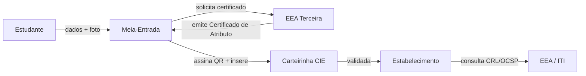

# Pesquisa EEA / ICP-Brasil — CIE v3.3

> **Data:** 2026-07-03
> **Propósito:** Alimentar ADR D-1 (caminho CIE: EEA própria, terceira ou documento privado?)
> **Fontes:** Conhecimento pré-treinado (modelo); Parecer Jurídico; Auditoria CIE v3.3; DOC-ICP-16; Portaria CIE v3.3
> *⚠️ Itens marcados com * são estimativas ou podem estar desatualizados — confirmar com ITI/MEC.*

---

## 1. Contexto: O Que é uma EEA?

Uma **Entidade Emissora de Atributo (EEA)** é uma entidade credenciada pela ICP-Brasil (ITI) para emitir **Certificados de Atributo**. Diferente do certificado digital tradicional (A1/A3 — identifica uma pessoa), o Certificado de Atributo **associa uma qualidade ou permissão** a uma pessoa — no caso, a condição de **estudante** para fins de meia-entrada.

A CIE v3.3 exige que a carteirinha contenha:
- Um **Certificado de Atributo** ICP-Brasil assinado por uma EEA
- Um **QR Code** com a assinatura digital do certificado
- Validação **offline** (o QR contém dados + assinatura que podem ser verificados sem internet)

---

## 2. Processo de Acreditação como EEA

### 2.1 Etapas (segundo DOC-ICP-01 e DOC-ICP-16)

1. **Solicitação ao ITI** — Entidade protocola pedido de credenciamento
2. **Auditoria** — Auditoria de processos, infraestrutura física e lógica (ISO 27001 + requisitos específicos ICP-Brasil)
3. **Implantação de infraestrutura** — HSM (Hardware Security Module), PKI, emissão de certificados
4. **Credenciamento** — Aprovação pelo ITI, publicação no Diário Oficial
5. **Operação** — Emissão de Certificados de Atributo

### 2.2 Timeline Estimada*

| Etapa | Duração estimada |
|---|---|
| Preparação documental | 2-3 meses |
| Auditoria inicial | 1-2 meses |
| Correções pós-auditoria | 1-3 meses |
| Aprovação ITI | 1-2 meses |
| **Total** | **6-12 meses** |

### 2.3 Custos Estimados*

| Item | Custo estimado |
|---|---|
| Taxas ITI (credenciamento) | R$ 10k-30k * |
| Auditoria ICP-Brasil | R$ 30k-80k * |
| HSM (certificado + manutenção anual) | R$ 10k-30k/ano * |
| Infraestrutura PKI | R$ 20k-50k * |
| Assessoria jurídica/técnica | R$ 20k-50k * |
| **Total estimado** | **R$ 90k-240k + 6-12 meses** |

*⚠️ Valores estimados — confirmar com ITI. Uma startup de pequeno porte provavelmente não tem capital/time para este caminho.*

---

## 3. Modelo de Integração com EEA Terceira (Alternativa Recomendada)

Em vez de se credenciar como EEA, a Meia-Entrada pode **integrar com uma EEA já credenciada**. A EEA emite o Certificado de Atributo, e a Meia-Entrada emite a carteirinha com esse certificado.

### 3.1 Como Funciona

### 3.2 Fluxo Técnico

1. Meia-Entrada coleta dados do estudante (já faz)
2. Meia-Entrada envia para a EEA os dados necessários (CPF, nome, validade, matrícula)
3. EEA gera o **Certificado de Atributo** assinado com sua chave ICP-Brasil
4. Meia-Entrada insere o certificado na carteirinha (QR Code com assinatura)
5. Estabelecimento valida offline: QR → verifica assinatura → verifica validade

### 3.3 Vantagens vs Credenciamento Próprio

| Critério | EEA Própria | Integração EEA Terceira |
|---|---|---|
| **Timeline** | 6-12 meses | 2-4 meses |
| **Custo inicial** | R$ 90k-240k | R$ 5k-30k (taxa de integração) |
| **Custo operacional** | HSM + equipe PKI | Taxa por certificado emitido |
| **Complexidade** | Alta (auditoria, HSM, PKI) | Média (API REST/integração) |
| **Risco regulatório** | Médio (processo de acreditação) | Baixo (EEA já credenciada) |
| **Controle** | Total | Parcial (depende da EEA) |

### 3.4 Exemplos de Modelo de Integração

No mercado brasileiro, algumas EEAs credenciadas oferecem integração para plataformas terceiras como **Autoridade de Registro (AR)** ou integração via API. A Meia-Entrada precisaria:

1. Contratar uma EEA que ofereça serviço de emissão de Certificado de Atributo
2. Celebrar contrato de prestação de serviço
3. Integrar via API REST para solicitar certificados
4. Pagar taxa por certificado emitido (estimado*: R$ 2-10/certificado)

---

## 4. DOC-ICP-16 v3.3 — Requisitos Técnicos

### 4.1 Estrutura do Certificado de Atributo

O Certificado de Atributo (RFC 5755) contém:

| Campo | Descrição |
|---|---|
| **Holder** | Titular do atributo (CPF do estudante) |
| **Issuer** | EEA que emitiu |
| **Attribute** | "Estudante" + instituição + curso + validade |
| **Validity period** | Data de início e fim (até 31/03/ano+1) |
| **Signature** | Assinatura digital da EEA (algoritmo: RSA 2048+ ou ECDSA) |
| **Serial number** | Identificador único do certificado |

### 4.2 QR Code

O QR Code da CIE v3.3 deve conter:

- Dados mínimos de validação (nome, validade, instituição, código de validação)
- **Assinatura digital** dos dados (permite validação offline)
- Algoritmo de hash: SHA-256 ou superior*
- Tamanho máximo: o QR deve ser escaneável por câmera de celular padrão (≤ 3KB de payload)

### 4.3 Validação Offline

O estabelecimento escaneia o QR → verifica a assinatura com a chave pública da EEA (obtida online periodicamente ou via cache) → confere validade → exibe dados.

### 4.4 CRL (Certificate Revocation List)*

EEAs devem manter lista de certificados revogados. A validação offline pode não consultar CRL em tempo real — o estabelecimento sincroniza periodicamente, ou o QR contém timestamp de validade que permite validação assíncrona.

---

## 5. Portaria CIE v3.3 — O Que Exige

### 5.1 Requisitos da Carteirinha

A **Portaria CIE v3.3** (e suas antecessoras, desde a Portaria nº 1/2016) e a **Lei 12.933/2013** estabelecem:

- **Layout padrão** nacional (foto, nome, instituição, validade, código de validação)
- **QR Code** com assinatura digital para validação offline
- **Certificado de Atributo** ICP-Brasil (assinado por EEA credenciada)
- **Validade:** até 31/03 do ano seguinte ao da emissão
- **Elementos de segurança:** contra falsificação

### 5.2 Quem Pode Emitir

- **EEAs credenciadas pela ICP-Brasil** — emitem o Certificado de Atributo
- **Plataformas integradas** — podem emitir a carteirinha física/digital contendo o certificado emitido pela EEA

---

## 6. Alternativas à ICP-Brasil

| Alternativa | Viabilidade para CIE | Risco |
|---|---|---|
| **Chave privada própria (self-signed)** | ❌ Não é CIE oficial | Alto — não reconhecida como CIE |
| **Blockchain** | ❌ Não regulamentado | Alto — sem respaldo legal |
| **PGP/GPG** | ❌ Não reconhecido | Alto — sem validade jurídica |
| **ICP-Brasil (única via)** | ✅ Obrigatória para CIE oficial | — |
| **Documento privado (sem CIE)** | ✅ Permitido — não é CIE, mas pode operar | Médio — risco de publicidade enganosa |

**Conclusão:** Para a **CIE oficial**, a ICP-Brasil é **obrigatória**. Não há alternativa juridicamente válida. Para operar como **documento privado**, nenhuma certificação é necessária — mas a carteirinha não será a CIE oficial.

---

## 7. Recomendação para ADR D-1

### 7.1 Cenário Recomendado: Integração com EEA Terceira

**Vantagens:**
- Timeline de 2-4 meses (vs 6-12 da acreditação própria)
- Custo de integração ~R$ 5k-30k (vs R$ 90k-240k)
- Risco regulatório baixo
- Permite começar S3 (decisão EEA) em 45 dias

**Requisitos para seguir:**
1. Identificar EEAs credenciadas que ofereçam integração via API
2. Negociar contrato + SLA + taxa por certificado
3. Adaptar schema de `carteiras` para armazenar certificado + assinatura
4. Desenvolver integração (API client)
5. Gerar QR Code com assinatura

### 7.2 Timeline Recomendada

| Fase | Duração | Atividade |
|---|---|---|
| Contratação EEA | 45 dias (S3) | Levantar EEAs, cotar, negociar contrato |
| Integração técnica | 60 dias (S4) | Desenvolver API + testar |
| Homologação ITI | 30 dias | ITI valida emissão |
| Go-live CIE | ~180 dias do início | Carteira oficial disponível |

---

## 8. Próximos Passos Concretos

1. **Identificar EEAs ativas no ITI** — Acessar site do ITI (iti.gov.br) e buscar lista de entidades credenciadas que emitem Certificado de Atributo. *Se não houver lista pública, solicitar via e-SIC.*
2. **Contactar EEAs** — Pelo menos 3 EEAs para cotar integração
3. **Solicitar minuta de contrato** — Verificar termos de SLA, taxa por certificado, responsabilidade
4. **Preparar estimativa para o CEO** — Custo total estimado: R$ 5k-30k setup + R$ 2-10/certificado
5. **Decidir D-1** — Se integração EEA inviável (nenhuma EEA oferece), considerar acreditação própria ou manter documento privado com disclaimer

---

## 9. Placeholders

| Item | Responsável | Prazo |
|---|---|---|
| Lista de EEAs credenciadas ativas | Pesquisa (ITI/e-SIC) | 15 dias |
| Cotações com 3 EEAs | CEO + Jurídico | 30 dias |
| Minuta de contrato de integração | Jurídico | 45 dias |
| Estimativa de volume de carteiras/ano | Analista de Negócio | 30 dias |

---

## Disclaimer

*Esta pesquisa baseia-se em conhecimento pré-treinado e pode conter informações desatualizadas. A Portaria CIE pode ter sido atualizada desde o último treinamento do modelo. **Confirmação obrigatória** com ITI (iti.gov.br) e MEC antes de decisões de investimento. Custos e prazos marcados com * são estimativas de mercado.*
