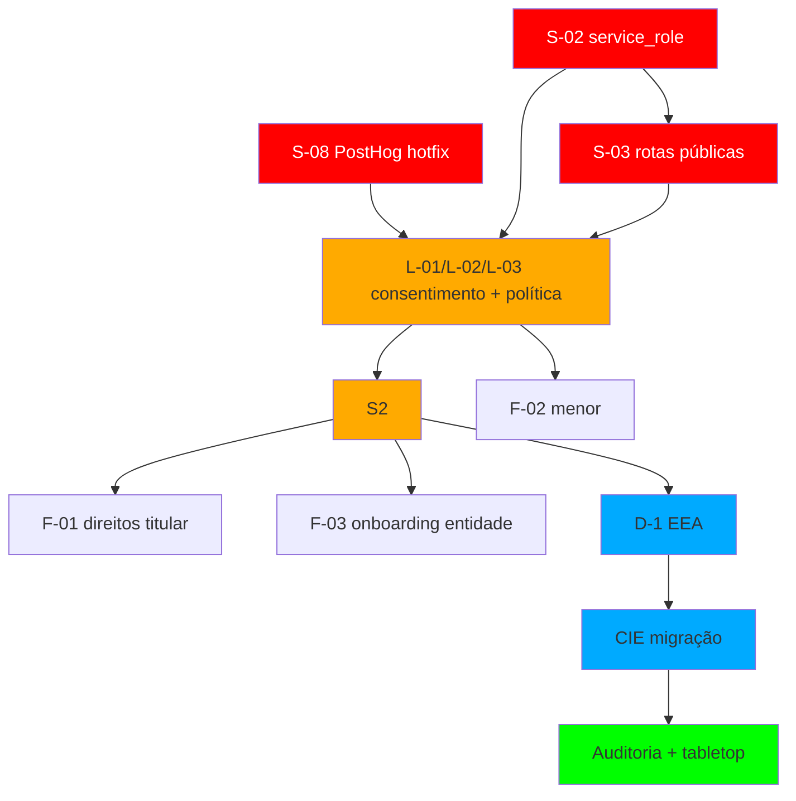

# Plano de Ação Técnico — Adequação LGPD + CIE v3.3 (Meia-Entrada)

> **Data:** 2026-07-03 (versão 1.0, pós-hotfix S-08)
> **Arquiteto:** agente senior software architect + systems analyst
> **Fontes:** Parecer Jurídico `2026-07-03-parecer-lgpd-meia-entrada.md`; Auditoria Segurança & LGPD `2026-07-03-auditoria-seguranca-lgpd.md`; Auditoria CIE v3.3 `2026-07-03-auditoria-cie-v3-3.md`; Resume dos repositórios `2026-07-03-resume-ate-fev-2026.md`.

---

## 0. Sumário Executivo

A plataforma Meia-Entrada opera hoje com **risco jurídico-extremo**: a chave `service_role` do Supabase está exposta no frontend (`up/web`), bypassando toda RLS; dados pessoais e a foto biométrica de estudantes são acessíveis publicamente por UUID/trivialmente-preditável; e o formulário coleta dados sensíveis sem consentimento. Além disso, a carteirinha emitida **não** é a CIE v3.3 oficial — falta Certificado de Atributo ICP-Brasil, assinatura criptográfica e QR validável.

**Top-5 ações por redução de risco/esforço:**
1. **S-08/S-02 (24h)** — parar exfiltração PostHog e remover `service_role` do web, fechando a porta aberta de PII.
2. **S-03/L-03/L-02 (7 dias)** — publicar Política de Privacidade, implementar dois checkboxes de consentimento (geral + foto biométrico) e proteger rotas públicas.
3. **F-03 (15-30 dias)** — contratar e registrar entidades emissoras como co-controladoras; bloquear emissão sem contrato vigente.
4. **F-01 (15-30 dias)** — criar canal de exercício de direitos do titular (art. 18/19 LGPD) com SLA de 15 dias.
5. **D-1/CIE (45-180 dias)** — decidir se Meia-Entrada se credencia como EEA ou integra EEA terceira; migrar QR para assinatura criptográfica.

**Decisões estratégicas pendentes:** modelo de DPO (central vs por entidade), atendimento de entidades sem CNPJ, custeio da adequação, e caminho EEA. Sem elas, S2 e S4 não saem do papel.

---

## 1. Matriz de Rastreabilidade Parecer → Plano

| ID Finding | Descrição resumida | Solução técnica | Artefatos afetados | Epic | Sprint | Critério de aceite | Dependências |
|---|---|---|---|---|---|---|---|
| **S-08** | PostHog `autocapture` + session recording capturam PII/biométrico do formulário | Desabilitar autocapture/session recording; isolar provider de `/pedido`; implementar cookie consent | `web/src/providers/PostHogProvider.tsx`, layout formulário | S-08 | **S0** | Zero eventos de input capturados; session recording off | — |
| **S-02** | `service_role` no frontend bypassa RLS | Trocar `base.ts` por `server.ts` com `anon` key; isolar `service_role` em `admin.ts` backend | `web/src/utils/supabase/base.ts`, `server.ts`, `getDadosCarteira.ts`, `getFotoEstudante.ts` | S-02 | **S0** | `grep -R SUPABASE_SERVICE_KEY web/src` vazio | — |
| **S-03** | Rotas `/v/[uuid]` e `/V/[token]` acessam PII sem autenticação | Token assinado de curta duração; projeção mínima; cache `no-store`; rate-limit | `web/src/app/v/[uuid]/page.tsx`, `web/src/app/V/[token]/page.tsx`, `getDadosCarteira.ts` | S-03 | **S0/S1** | Rota pública só expõe campos essenciais de validação; token expira em N min | S-02 |
| **S-07** | Storage policy `TO public` amplia acesso | Remover policy; verificar posse em `getFotoEstudante` via RLS | Supabase policies, `getFotoEstudante.ts` | S-07 | **S1** | Policy `TO public` removida; foto só lida por dono/autorizado | S-02 |
| **S-04** | Ausência de `middleware.ts` | Criar `middleware.ts` em admin e web chamando `updateSession` | `middleware.ts` (raiz de ambos), `updateSession.ts` | S-04 | **S1** | Middleware ativo; sessão renovada; rotas protegidas por padrão | — |
| **S-05** | Headers de segurança ausentes | Adicionar CSP, HSTS, X-Frame-Options, Referrer-Policy em `next.config.mjs` | `next.config.mjs` (ambos) | S-05 | **S1** | Headers presentes em resposta HTTP | — |
| **S-06** | `SELECT *` em `carteiras` | Projeção explícita; minimização de dados em queries | `getDadosCarteira.ts`, `getFotoEstudante.ts`, queries Supabase | S-06 | **S1** | Zero `SELECT *` em tabelas PII; apenas colunas necessárias | S-02 |
| **M-02** | Senhas hardcoded em testes | Mover para `.env.test`; secret-scanning no CI; rotacionar se real | `e2e/fixtures/auth.ts`, `create-test-users.js`, `.github/workflows/ci.yml` | M-02 | **S1** | Senhas não versionadas; gitleaks no CI | — |
| **L-01** | Sem consentimento LGPD | Checkbox de consentimento geral; vinculação à versão da política | `web/src/components/form/steps/step-pessoais.tsx`, `lgpd_consents` | L-01 | **S1** | Formulário não submete sem consentimento geral | Política 01 |
| **L-02** | Sem consentimento específico para foto | Checkbox separado para dado biométrico (art. 11); alternativa de retirada | `step-pessoais.tsx`, `FileUploadField.tsx`, `lgpd_consents` | L-02 | **S1** | Checkbox separado aceito; foto não coletada sem aceite | L-01, Política 01 |
| **L-03** | Sem política de privacidade | Publicar `/privacidade`; versionar; linkar no consentimento | Página `/privacidade`, `lgpd_policy_versions` | L-03 | **S1** | Política acessível, datada, com DPO e direitos | Subprompt 01 |
| **L-04** | Sem informação sobre retenção/direitos | Resumo de retenção e direitos na política; portal de direitos F-01 | `/privacidade`, `/direitos`, `lgpd_subject_requests` | F-01 | **S2** | Titular consegue exercer direitos; SLA 15 dias | Subprompts 07, 01 |
| **L-05** | Sem rate-limit/captcha | Rate-limit por IP/entidade; Turnstile/hCaptcha no `createCarteiraAction` | `app/actions/createCarteira.ts`, infra (Redis/Upstash) | L-05 | **S1** | 100 requests/IP/hora; captcha presente | — |
| **L-06** | Sem DPO/canal | Nomear DPO; publicar e-mail; integrar canal no admin | `/privacidade`, `admin/src/...`, `lgpd_subject_requests` | L-06 | **S2** | DPO identificado; canal funcional; resposta em 15d | Subprompt 01 |
| **F-02** | Menores sem consentimento do responsável | Ramificação formulário: tutelante + consentimento específico | `step-pessoais.tsx`, `lgpd_consents` | F-02 | **S1** | Menor não emite sem consentimento do responsável | L-01/L-02 |
| **F-03** | Onboarding informal de entidades | KYC, contrato de co-controladora, gate de emissão | `admin` onboarding, `CriarCarteiraButton.tsx`, `lgpd_contracts` | F-03 | **S2** | Emissão bloqueada sem contrato vigente | Subprompt 04 |
| **C-01..C-06** | CIE v3.3 não implementada | Decidir EEA; integrar certificado de atributo; assinar QR; validador offline | `admin/src/card`, `web/src/app/V`, schema `carteiras` | CIE | **S3-S5** | Carteira valida offline com assinatura ICP-Brasil | D-1, D-2, D-3 |
| **M-01** | Publicidade enganosa | Auditar e reescrever copy do site; disclaimers não-enganosos | `web/src/app/[entidade]/*`, entidade tiptap texts | M-01 | **S1** | Termos proibidos removidos; disclaimer visível | Subprompt 09 |

---

## 2. Roadmap em Sprints

| Sprint | Janela | Fonte do prazo | Escopo |
|---|---|---|---|
| **S0 — Sangramento (24h)** | 24h | S-08, S-02, S-03 (Parecer top-3) | PostHog hotfix; remover `service_role` do web; proteger rotas públicas com token assinado; projeção mínima |
| **S1 — LGPD básico (7-15d)** | 7-15 dias | L-01..L-03, S-04..S-07, M-02, M-01 | Política + consentimento (2 checkboxes); middleware; headers; rate-limit/captcha; XSS sanitização; senhas hardcoded; copy marketing |
| **S2 — Governança (15-30d)** | 15-30 dias | L-04..L-06, F-01..F-03 | DPO/canal; portal de direitos; onboarding entidade + contrato; RIPD; RDM; retenção; contratos operador/co-controladora; governança pessoas |
| **S3 — Decisão EEA (45d)** | 45 dias | Parecer recomendação | Levantar EEA credenciadas; modelar custo/tempo; ADR D-1; POC técnica de assinatura; schema estendido |
| **S4 — Migração CIE (90-180d)** | 90-180 dias | Parecer recomendação | Integrar EEA; Certificado de Atributo; assinar QR/PDF; validador offline; layout nacional |
| **S5 — Verificação (180d)** | 180 dias | Parecer recomendação | Auditoria técnica; tabletop incidente; testes E2E de validação CIE; retreinamento; revisão RIPD |

---

## 3. Detalhamento por Epic

### Epic S-08 — PostHog Autocapture + Session Recording
**Problem statement:** `PostHogProvider.tsx` inicializa PostHog com `autocapture: true` e `disable_session_recording: false`. No formulário de PII/biométrico, isso captura valores de input e grava a tela, enviando dados sensíveis para PostHog Cloud (EUA). Violação de transferência internacional (art. 33/36 LGPD) e de segurança (art. 46).
**Solução:** Hotfix de 1 linha: `autocapture: false`, `disable_session_recording: true`. Sprint S0. Em S1, implementar cookie-consent gate para analytics; só reabilitar com opt-in explícito e `maskAllInputs: true`.
**Alternativas:** (a) manter e mascarar tudo — arriscado, ainda envia PII se config errada; (b) remover PostHog — perde analytics de produto; (c) self-host PostHog — custo/ops extra.
**Implementação:** `web/src/providers/PostHogProvider.tsx` (2 linhas já alteradas na branch `fix/posthog-autocapture-privacy`). Em S1, criar componente `CookieConsentBanner` e condicionar `PostHogProvider` às rotas não-PII.
**Pacto API:** nenhuma mudança de API.
**Testes:** Playwright verifica que não há requests para `app.posthog.com` ao digitar no formulário; Vitest para `CookieConsent` lógica.
**Critério de aceite:** `autocapture: false`, `disable_session_recording: true` em prod; zero eventos de input capturados em staging.
**Esforço:** 1 (hotfix) + 3 (S1 consent gate) = 4 pontos. **Dependências:** —.

### Epic S-02 — Remover `service_role` do Frontend Web
**Problem statement:** `web/src/utils/supabase/base.ts` usa `SUPABASE_SERVICE_KEY`, bypassando RLS. Qualquer cliente pode ler/alterar tudo.
**Solução:** Trocar `base.ts` para usar `createServerClient` com `anon` key e cookies; criar `admin.ts` (backend-only) para operações legítimas que precisam de privilégio.
**Artefatos:** `web/src/utils/supabase/base.ts`, `server.ts`, `getDadosCarteira.ts`, `getFotoEstudante.ts`, `createCarteira.ts`.
**Testes:** Vitest para `createClient` com `anon` key; E2E valida que rota pública não acessa PII privilegiado.
**Critério de aceite:** `grep -R SUPABASE_SERVICE_KEY web/src` retorna vazio; RLS policies efetivamente aplicadas.
**Esforço:** 5 pontos. **Dependências:** —.

### Epic S-03 — Proteger Rotas Públicas `/v/[uuid]` e `/V/[token]`
**Problem statement:** Rotas públicas fazem `SELECT *` em `carteiras` por UUID/token. Exposição massiva de PII.
**Solução:** (1) token `V/[token]` deixa de ser `base36(timestamp)` — vira token criptograficamente aleatório de uso único (PASETO/JWT assinado, TTL curto). (2) Rota só expõe dados mínimos de validação (foto, nome, status, validade, instituicao). (3) `Cache-Control: no-store`. (4) rate-limit.
**Pacto:** `GET /V/{token}` → `{nome, foto_url, instituicao, status, validade, assinatura}` (não CPF/RG/filiação).
**Testes:** E2E tenta acessar UUID inexistente/sem token; fuzzing de tokens.
**Esforço:** 8 pontos. **Dependências:** S-02 (sem service_role não há como ajustar RLS corretamente).

### Epic L-01/L-02 — Consentimento LGPD + Consentimento de Foto
**Problem statement:** Formulário não tem consentimento; foto (biométrico) coletada sem base legal específica (art. 11).
**Solução:** Dois checkboxes, separados: (a) tratamento geral; (b) foto. Ambos vinculados à `lgpd_policy_versions` ativa, com `ip_hash`, `user_agent`, `accepted_at`. Alternativa de retirada presencial para quem recusa foto.
**Schema:** `lgpd_consents(id, titular_id, scope, policy_version, accepted_at, ip_hash, user_agent, withdrawn_at)`.
**Artefatos:** `step-pessoais.tsx`, `step-pagamentos.tsx`, `createCarteira.ts`, `FormContext.tsx`.
**Testes:** Playwright recusa form sem checkboxes; aceita com foto; recusa de foto leva a fluxo de retirada.
**Esforço:** 8 pontos. **Dependências:** Subprompt 01 (Política de Privacidade).

### Epic F-02 — Consentimento do Responsável Legal (Menores)
**Problem statement:** Estudantes do fundamental/médio são menores; art. 14 LGPD exige consentimento do responsável. Hoje só coleta `nome_mae`/`nome_pai`, não o consentimento.
**Solução:** Se `data_nascimento` indica menor, ramificar formulário para dados + consentimento do responsável. Criar tabela `lgpd_guardian_consents` ou estender `lgpd_consents` com `guardian_id`. Responsável recebe e-mail/SMS de confirmação (futuro).
**Testes:** E2E: menor sem consentimento do responsável → bloqueado; com consentimento → emite.
**Esforço:** 8 pontos. **Dependências:** L-01/L-02.

### Epic F-01 — Portal de Exercício de Direitos do Titular
**Problem statement:** Titular não tem canal para acessar, retificar, eliminar ou portar dados. Art. 18/19 LGPD exige resposta em 15 dias.
**Solução:** Rota pública `/direitos` (web) + fila no admin (`/admin/lgpd/requests`). Tabela `lgpd_subject_requests(id, titular_id, tipo, status, created_at, resolved_at, resolution)`. Prova de posse via e-mail/telefone verificado. Menores via responsável.
**Artefatos:** `web/src/app/direitos/page.tsx`, `admin/src/app/lgpd/requests/page.tsx`, Server Actions.
**Testes:** E2E: titular pede eliminação; DPO marca resolvido; e-mail de confirmação.
**Esforço:** 13 pontos. **Dependências:** Subprompt 01, L-03, D-5.

### Epic F-03 — Onboarding/KYC de Entidade + Gate de Contrato
**Problem statement:** Entidades emissoras são co-controladoras, mas onboarding é informal; qualquer entidade pode emitir sem contrato.
**Solução:** Fluxo de cadastro de entidade com documentos (CNPJ quando houver, razão social, responsável). Contrato de co-controladora (subprompt 04) versionado em `lgpd_contracts`. Gate técnico: `CriarCarteiraButton` e Server Actions bloqueiam emissão se `contrato_vigente(entidade_id) = false`.
**Artefatos:** `admin/src/app/entidades/onboarding`, `CriarCarteiraButton.tsx`, `createCarteira.ts`.
**Testes:** E2E: entidade sem contrato → não emite; com contrato → emite e audita.
**Esforço:** 13 pontos. **Dependências:** Subprompt 04, decisão N-2 (sem CNPJ).

### Epic CIE — Migração para CIE v3.3
**Problem statement:** Carteira não tem Certificado de Atributo ICP-Brasil, assinatura criptográfica, nem QR validável. É apenas documento privado.
**Solução:** Faseada: (1) ADR D-1 (EEA própria vs terceira); (2) estender schema `carteiras` com `cie_version`, `certificado_atributo`, `assinatura_digital`, `codigo_validacao_nacional`; (3) assinar QR/PDF com chave EEA; (4) validador offline/online; (5) layout nacional.
**Esforço:** 40+ pontos (S3-S5). **Dependências:** D-1, D-2, D-3, EEA parceira.

---

## 4. Decisões de Arquitetura Pendentes (ADRs)

| ID | Decisão | Opções | Recomendação | Owner | Prazo |
|---|---|---|---|---|---|
| **D-1** | EEA própria, terceira ou documento privado? | (a) credenciar Meia-Entrada como EEA; (b) integrar EEA parceira; (c) manter documento privado | **(b) integrar EEA terceira** no curto prazo — menos custo e tempo; (a) só se houver receita para suportar 6-12m de acreditação | CEO/Fundador + DPO | 45 dias |
| **D-2** | Onde ficam as chaves de assinatura CIE? | KMS cloud (AWS/GCP), HSM cloud, EEA parceira | **KMS cloud** para MVP; HSM só em escala/EEA própria | CTO/Arquiteto | 90 dias |
| **D-3** | Validador CIE: app, web ou ambos? | App nativo, web PWA, integração ANPG | **PWA web** primeiro (menor atrito); app nativo se exigido por estabelecimentos | Produto | 90 dias |
| **D-4** | Unificar admin+web? | Manter 2 repos vs monorepo | **Manter 2 repos** até CIE estável; unificar camada de assinatura em pacote compartilhado | CTO | S3 |
| **D-5** | Prazos de retenção por categoria? | Fotos X dias; cadastro Y anos; logs Z anos | **Foto 1 ano após validade**; cadastro ativo enquanto estudante + 1 ano; logs 5 anos; hard-delete 90 dias após "removida" | DPO/Jurídico | S2 |
| **D-6** | DPO centralizado ou por entidade? | 1 DPO Meia-Entrada para todas; cada entidade tem DPO próprio; híbrido | **1 DPO central (Meia-Entrada) + contato local por entidade** (delegado, não substituto) | CEO/Fundador | S2 |
| **D-7** | Atender entidades sem CNPJ? | Sim, com termo do responsável; só com CNPJ; não atender | **Só com CNPJ ou associação formalizada** (reduz risco de co-controladoria sem personalidade jurídica) | CEO/Fundador + Jurídico | S2 |

---

## 5. Schema de Banco — Migrations Propostas

| Arquivo | Tipo | Intenção | Findings |
|---|---|---|---|
| `20260703100000_create_lgpd_policy_versions.sql` | CREATE | Tabela de versões de política (hash, conteúdo, effective_at) | L-03 |
| `20260703100001_create_lgpd_consents.sql` | CREATE | Consentimentos geral/foto/menor com versionamento | L-01, L-02, F-02 |
| `20260703100002_create_lgpd_subject_requests.sql` | CREATE | Pedidos de direitos do titular | F-01, L-04 |
| `20260703100003_create_lgpd_contracts.sql` | CREATE | Contratos co-controlador/operador | F-03, L-05 |
| `20260703100004_create_access_audit_log.sql` | CREATE | Log de SELECT/READ em PII (além do deletion audit) | S-02, F-03 |
| `20260703100005_alter_carteiras_validation_token.sql` | ALTER | Substituir `token` por token criptográfico/assinado | S-03, CIE |
| `20260703100006_cie_fields_carteiras.sql` | ALTER | Adicionar `cie_version`, `certificado_atributo`, `assinatura_digital`, `codigo_validacao_nacional` | CIE |
| `20260703100007_remove_public_storage_policy.sql` | POLICY | Remover `TO public` e reforçar posse | S-07 |
| `20260703100008_rls_public_routes.sql` | POLICY | RLS para token de validação pública | S-02, S-03 |

---

## 6. Mapa de Dependências & Caminho Crítico

**Caminho crítico:** S0 → S1 → S2 → S3 → S4 → S5.

---

## 7. Gestão de Risco de Execução

| Risco | Prob | Impacto | Mitigação | Dono |
|---|---|---|---|---|
| EEA não credencia a tempo | Média | Alto | ADR D-1: integrar EEA terceira; MVP com documento privado + disclaimer | CEO |
| Churn de entidades por compliance | Média | Alto | Análise de pricing (Analista); segmentar; absorver parte do custo | Analista de Negócio |
| Quebra de backward-compat das carteiras | Média | Médio | Manter validador antigo durante transição; aviso de reemissão | Produto |
| Vazamento de service_role no histórico git | Alta | Alto | Rotacionar chave; `git filter-repo`; secret-scanning | CTO |
| Equipe atual não consegue cumprir S0 em 24h | Média | Alto | Priorizar: S-08 (1 linha), depois S-02 (remove service_role), depois S-03 | CTO |
| Falta de decisão D-5/D-6/D-7 bloqueia S2 | Média | Alto | Marcar reunião CEO/DPO/jurídico na semana 1 | PMO |

---

## 8. Delegação de Copy Jurídica (Subagentes)

| Entregável | Subprompt | Alimenta | Sprint | Critério técnico de aceite |
|---|---|---|---|---|
| Política de Privacidade + Consentimento | `01-politica-privacidade-e-consentimento.md` | L-01, L-02, L-03 | S1 | Política versionada e hashada; 2 checkboxes; link DPO funcional |
| Termos de Uso + disclaimer | `02-termos-uso-estudante.md` | M-01/M-02 | S1 | Termos versionados; disclaimer dinâmico; feature flag CIE |
| Contrato operador | `03-contrato-operador.md` | L-05, S-08 | S2 | DPA assinado; SCC anexado; anexo II coerente com medidas técnicas |
| Contrato co-controladora | `04-contrato-cocontroladora-entidade.md` | F-03 | S2 | Gate de emissão vincula a `lgpd_contracts.effective_at` |
| RIPD | `05-ripd.md` | L-05, CIE | S2 | Risco S-08 mapeado; mitigações linkadas a epics |
| Runbook incidente | `06-runbook-incidente-anpd.md` | L-05 | S2 | 72h úteis ANPD; templates e-mail titular |
| Política de retenção | `07-politica-retencao.md` | L-04, D-5 | S2 | Prazos por categoria; job de eliminação mapeado |
| RDM | `08-rdm-registro-operacoes.md` | L-05 | S2 | Inventário operacional; CI gate em migrations |
| Copy marketing | `09-auditoria-copy-marketing.md` | M-01 | S1 | Check de termos proibidos no CI |
| Governança pessoas | `10-governanca-pessoas-processo.md` | L-05 | S2 | `lgpd_people_log`; access_audit_log; offboarding checklist |

---

## 9. Critérios de "Done" Globais

- [ ] Todo `SUPABASE_SERVICE_KEY` removido do `web`
- [ ] `middleware.ts` ativo em admin e web
- [ ] Consentimento LGPD com 2 checkboxes (geral + foto) versionado
- [ ] Política de Privacidade publicada em `/privacidade` com DPO e direitos
- [ ] Portal de direitos do titular funcional (`/direitos`) com SLA 15 dias
- [ ] Emissão de carteira bloqueada sem contrato de co-controladora vigente
- [ ] RIPD, RDM e Política de Retenção publicados
- [ ] DPO nomeado e canal funcional
- [ ] Copy do site sem alegações enganosas; disclaimers visíveis
- [ ] Carteira CIE valida offline com assinatura ICP-Brasil (S4/S5)
- [ ] Testes E2E cobrem S-02, S-03, L-01, L-02, F-02, F-03

---

## 10. Initiation Checklist (primeiros 10 min)

- [ ] Confirmar que branch `fix/posthog-autocapture-privacy` existe e hotfix foi commitado
- [ ] Rodar `npm run lint` e `npm run test` em `web` após S-08
- [ ] Verificar se `NEXT_PUBLIC_POSTHOG_KEY` está em produção e se há outras chaves expostas
- [ ] Abrir ADR D-1, D-6, D-7 para decisão do CEO
- [ ] Marcar reunião de kickoff S1 com Davi + devs

---

*Plano v1.0. Atualizar após execução de S0 e decisões D-1/D-6/D-7.*