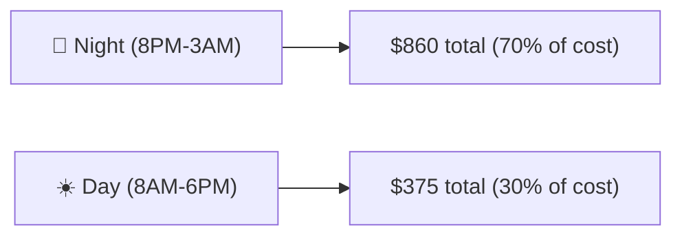

# Personal Usage Study — Pi Agent Cost Analysis

> Generated from `pi-telemetry.db` analysis. All metrics are offline, zero-token.

## Executive Summary

Your Pi work agent spent **$1,234 in the last 14 days**, with **$787 (64%) on GPT-5.5** alone.
The biggest contributor is not our config bloat — it's **session structure and model choice**.

| Metric | Value |
|---|---|
| Total cost (work agent, 14d) | **$1,234** |
| GPT-5.5 cost (work, 14d) | **$787 (64%)** |
| Avg cost per session (GPT-5.5) | **$14.31** |
| Avg turns per session (GPT-5.5) | **273 turns** |
| Avg cost per turn (GPT-5.5) | **$0.034** |
| Cache hit rate | **77%** (system prompt cached after turn 1) |
| Most expensive single session | **XTRNT-701: $180.68 (960 turns)** |

## The 3 Archetypes of Expensive Sessions

### 1. The Deep Dive — task-structured, high cost

```
task:XTRNT-701 → $418 across 7 sessions (53% of all work cost!)
```

You work on a single complex ticket for **hours across multiple sessions**.
The problem: each session is 500-1000+ turns, and **long sessions cost 3x more per turn**
than short ones.

| Session length | Cost/turn | Relative efficiency |
|---|---|---|
| <200 turns | **$0.02-0.03** | ✅ Efficient |
| 200-500 turns | **$0.035** | ⚠️ 40% more |
| 500-1000 turns | **$0.063** | 🔴 3x more |
| 1000+ turns | **$0.066** | 🔴 3x more |

**Why?** Each turn re-reads the entire conversation. A 1000-turn session pays for ~500k tokens
of growing history — most of it cached, but output tokens accumulate.

### 2. The Open-Ended Exploration

```
"Hey there! What's up? New week new work..." → $31.78, 828 turns
"Good afternoon! How are you?..." → $18.55, 641 turns
```

Sessions starting with a greeting instead of a concrete task cost **50% more per session**
because there's no scope boundary. The model meanders until you eventually narrow it down.

### 3. The Manual Context Resume

```
"Resumo para nova janela de contexto:" → $27.92, 714 turns
```

You manually wrote a summary to start a new context window. **Pi has `/resume` built in**
that does this automatically — it summarizes the old session and starts a new one
with all context preserved.

## Time-of-Day Pattern



Most expensive sessions happen at night. Possible factors:
- Complex tickets tackled after hours (XTRNT-701 at 2AM, 9PM, 12AM)
- Fatigue → less structured prompts, more turns per task
- No interruption pressure → sessions run longer

## User Improvement Opportunities

### High Impact: Session Structure

| Current | Recommended | Savings estimate |
|---|---|---|
| 1 session of 1000 turns ($82) | 4 sessions of 250 turns ($40) | **~50%** |
| Start with "Hey there" | Start with concrete task statement | **~30%** |
| Manual context copy | Use `/resume` command | **time saved** |

**Specific tactics:**
1. **First message = ticket scope**: instead of "Hey there! What's up? New week new work",
   write: "I need to implement XTRNT-701: add user validation to the reservation flow.
   The requirements are in `/path/to/ticket.md`. Let's start by..."
2. **Bound sessions by milestone**: when you hit a natural stopping point (test passes,
   PR ready, decision made), end the session with `/resume` and start fresh.
3. **Use `/resume`**: when context gets long (>200 turns), run `/resume` instead of
   continuing. Pi creates a new session with a summary.

### Medium Impact: Model Selection

| Model | Relative cost | Best for |
|---|---|---|
| **deepseek-v4-pro** | **1x (baseline)** | Most coding tasks |
| deepseek-v4-flash | 0.1x | Simple edits, lookups |
| gpt-5.4-mini | 2x | Moderate complexity |
| **gpt-5.5** | **6x** | Only when deepseek fails |

If you switched 80% of sessions to deepseek-v4-pro, your 14-day cost would drop from
**$1,234 → ~$300**. Keep GPT-5.5 for the truly hard problems.

### Low Impact (But Worth Doing): Config Trimming

| Action | Savings/session |
|---|---|
| Shorten skill descriptions (1,638→1,000 tok) | ~$0.30 |
| Merge rules (898→500 tok) | ~$0.20 |
| Trim AGENTS.md (886→600 tok) | ~$0.15 |
| **Total** | **~$0.65/session** |

This helps, but is 10x smaller than the session-structure lever.

## Learning Path

### Prompt Engineering for Agent Interactions

Most prompt engineering resources focus on single-shot prompts (ChatGPT, API calls).
Agent interactions (Pi, Cursor, Claude Code) are different — they're **multi-turn
conversations with tools**. Here's what actually matters:

**Core concepts (start here):**
1. **First message sets the task vector** — the model anchors on the first user message.
   A specific first message → focused session. A vague one → meandering session.
2. **Decomposition** — break a complex task into 3-5 focused sessions, each with a
   concrete deliverable. Each session stays under 200 turns.
3. **Context budget awareness** — every token in = cost. Be concise in your prompts.
   The model doesn't need your full thought process, just the requirements.

**Pi-specific:**
4. **Skill activation** — `/skill:skill-name` activates a skill. Use it deliberately.
   Don't let the model guess which skill to use.
5. **`/resume vs /compact`** — `/resume` summarizes and starts fresh; `/compact` shrinks
   old turns in-place. Use `/resume` when changing tasks, `/compact` when continuing.
6. **Structured task format** — `task:TICKET-123` as session name helps you and the
   model stay on track.

**Recommended resources:**
- [Anthropic's Prompt Engineering Guide](https://docs.anthropic.com/en/docs/build-with-claude/prompt-engineering)
  — best practical guide for Claude models
- [OpenAI's Prompt Engineering Guide](https://platform.openai.com/docs/guides/prompt-engineering)
  — good for understanding what models see
- [Pi's skill system docs](https://pi.sh/docs/skills) — understand what your agent
  is loading each turn

### AI Engineering: Understanding Your Tools

**Concepts that directly affect your costs:**
1. **Context window** — how the model "sees" the conversation. Full history means
   every turn pays for every previous turn.
2. **Caching** — 77% of your tokens are cached. The first turn of a session pays full
   price, subsequent turns pay ~50% for the system prompt portion.
3. **Output tokens cost 4-10x input tokens** — be concise in what you ask the model
   to produce. "Summarize in 3 bullet points" costs less than "write a detailed report".
4. **Tool call overhead** — each tool call (read file, run command, search) adds
   the tool name, arguments, and result to context. Use targeted reads, not whole files.

**Recommended resources:**
- [Building Effective Agents (Anthropic)](https://docs.anthropic.com/en/docs/build-with-claude/agent-patterns)
  — the best practical guide on agent patterns
- [Latent Space: The AI Engineering Podcast](https://www.latent.space/podcast) —
  interviews with top AI engineers
- [Simon Willison's blog](https://simonwillison.net/) — practical AI engineering
  from a Django/Python perspective

## Action Plan

### This Week
1. ✅ Start naming sessions `task:TICKET-123` (you already do this — keep it up)
2. ✅ Start sessions with a concrete task, not a greeting
3. 🎯 Try `/resume` the next time a session hits 200+ turns
4. 🎯 Try deepseek-v4-pro for one afternoon of work — compare quality

### Next Week
5. 🎯 Review the `/resume` experiment — did it save cost? Did quality suffer?
6. 🎯 Evaluate deepseek-v4-pro quality vs GPT-5.5 for your specific work
7. 🎯 Implement the config trimming (descriptions + rules + AGENTS.md)

### Ongoing
8. 📊 Run `./pi-setup/harness-audit.sh --quick` weekly to track cost trends
9. 📊 If you switch models, compare the weekly cost before/after
10. 📊 Revisit this study in 30 days — what changed?

---

*Generated from pi-telemetry.db | Blended rate: $1.45/M tok | Study date: 2026-07-03*
