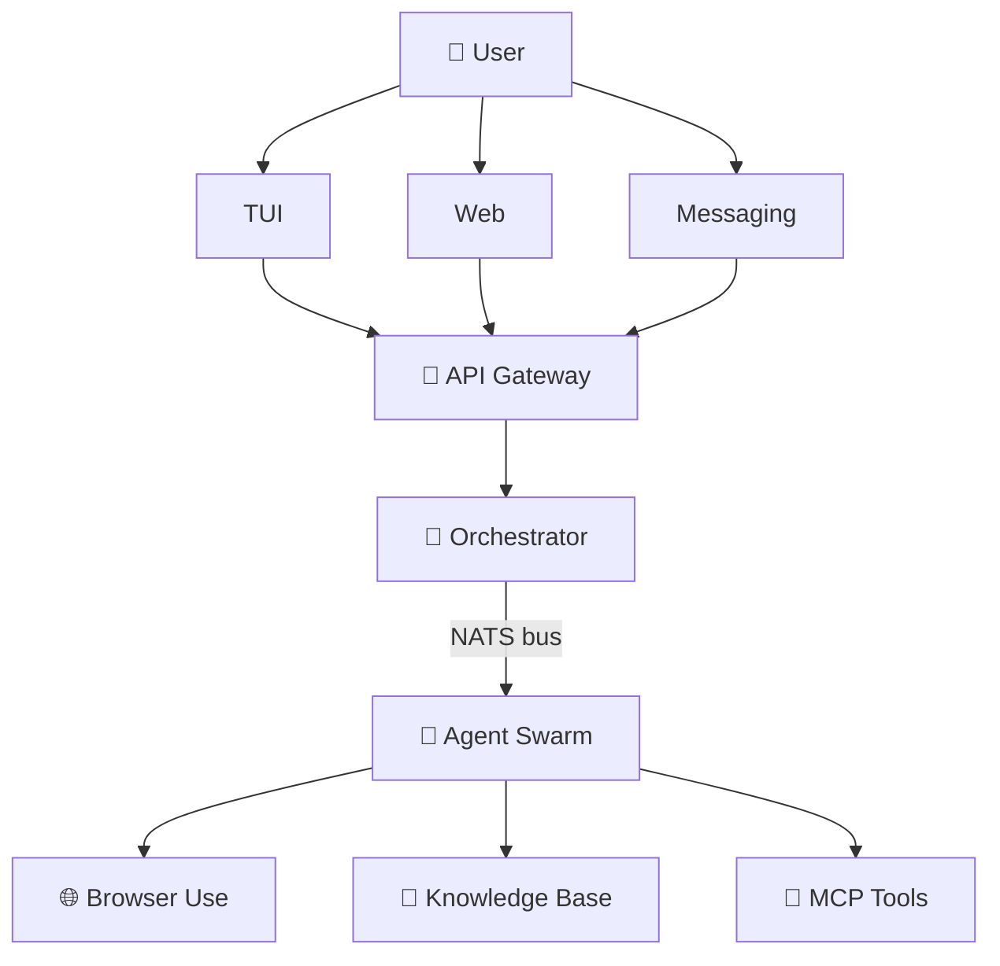

# AI Workspace v2 — Comprehensive AI Workspace Architecture
*Omnichannel, browser-based AI agents with orchestration, calendar, workspaces, and knowledge*

## Vision: "Everything workspace from anywhere"
A single self-hostable CLI that provides:
- **Omnichannel AI**: TUI, web dashboard, messaging bots, voice
- **Browser agents**: Research, form filling, data extraction
- **Intelligent coding**: Write, debug, open PRs
- **Unified knowledge**: Research + code + tasks + calendar, all searchable
- **Agent swarms**: Spawn delegate agents for deep execution
- **Multi-workspace**: Personal vs work separation

---

## Core Principles
1. **Self-hostable**: Run on homelab or laptop
2. **Extensible**: MCP-first integration
3. **Persistent**: Long-term memory, session resumption
4. **Multi-agent**: Orchestrate specialized agents
5. **Context-aware**: Understands calendar, tasks, system state

---

## Stack Choices
| Area | Technology | Why |
|------|-----------|-----|
| Language | Go + Python | Go for infra, Python for LLM |
| Agent Framework | Karna (inspired) | Multi-channel, actor-based |
| Browser Agent | browser-use | MCP-powered autonomous browser |
| Memory | PostgreSQL + pgvector | Structured + semantic search |
| Orchestration | NATS | Lightweight event bus |
| MCP Tools | mcp.directory + apigene.ai | Discovery and marketplace |

---

## Architecture


---

## Browser Agent (browser-use)
```python
from browser_use.beta import Agent, ChatBrowserUse

agent = Agent(
    task="Extract AI job postings from LinkedIn",
    llm=ChatBrowserUse(model="claude-3-7-sonnet"),
    browser_profile=BrowserProfile(help_text="Use LinkedIn filters"),
)
agent.run()  # Returns markdown summaries
```

*MCP server:* `mcpx run --stdio` exposes Playwright control as MCP tools

---

## MCP Marketplace
```bash
aiw workspace add --name scrape --mcp apigene.ai/mcp/47aa3f
# Connects browser MCP server
aiw task add --work space "Scrape latest AI papers" --agent scrape/browser
```

Discover MCP tools: [`mcp.directory`](https://mcp.directory), [`apigene.ai`](https://apigene.ai)

---

## Workspaces (Personal vs Work)
```yaml
# ~/.config/aiw/workspaces.yml
workspaces:
  personal:
    allowed_models: ["llama-3", "gemini-3"]
    mcp_servers: ["browser-personal", "calendar-personal"]
    context_tags: ["#family", "#hobbies"]
  work:
    allowed_models: ["claude-3-7-team", "codestral"]
    mcp_servers: ["github-internal", "jira", "corporate-calendar"]
    workspace_tags: ["#sensitive"]
```

---

## Sample User Journeys

### Research Task via WhatsApp
```
User: "Find MCP servers for scraping"
→ Agent spawns in *personal* workspace
→ Uses *browser-use* MCP to extract data
→ Cross-references *mcp.directory* via API
→ Returns structured report
```

### Coding Task via TUI
```bash
> /task "Build MCP tool for browser" --workspace work
→ Spawns coding agent
→ Checks out template repo
→ Opens PR to distillation-labs/browser-mcp
→ Sets GitHub review reminder *next Tuesday 2pm* 
```

---

## Roadmap
1. Port aiw v1 knowledge engine
2. Build omnichannel gateway (TUI + web)
3. Integrate browser-use MCP server
4. Agent swarm orchestration (NATS bus)
5. Workspace separation logic
6. Calendar MCP integration

---

## Resources
- Agent Orchestration: [Karna](https://github.com/MukundaKatta/karna)
- Browser Agents: [browser-use](https://github.com/browser-use/browser-use)
- MCP Tools: [MCP.directory](https://mcp.directory) + [apigene.ai](https://apigene.ai)