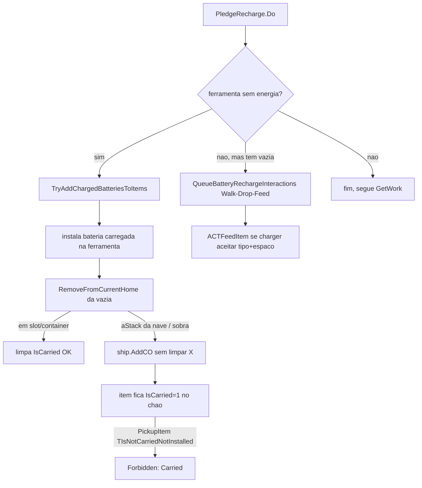

# Ostranauts — Arquitetura de IA e Interações (Guia de Design de Mods/Fixes)

> Documento técnico gerado a partir da leitura dos fontes decompilados
> (`/tmp/game_api_full`: 612 arquivos do `Assembly-CSharp.dll` + dados de `StreamingAssets`).
> Objetivo: servir de referência para o design de mods/fixes C# e data mods.
> Jogo: v1.0.0.9 (buildid 24663190).

---

## 1. Mapa geral de sistemas

```
                    +------------------+
                    |   CrewSim (Monobehaviour, singlentó)  |
                    |   `AdvanceSim(fDelta)`  <-- game loop |
                    +------------------+
                             |
                             v
              +-----------------------------------+
              |  CondOwner (uma crew/npc/robot/item) |
              |  `UpdateManual()` por-tick         |
              +-----------------------------------+
                |
                |  cada "turno" (fLastICOUpdate)  ->  EndTurn()
                v
      +------------------------------------------------------+
      |  EndTurn()  (tomada de decisão da IA)                |
      |                                                       |
      |  1) atualiza condições temporais (aCondsTimed)        |
      |  2) AIHandleCancels / CleanupReplies                  |
      |  3) ShiftChange (troca de turno por hora)             |
      |  4) HasPledgeEmergency -> via rápida (só IsEmergency) |
      |  5) else  processa a fila de interações (aQueue)      |
      +------------------------------------------------------+
                |
                v  (fila vazia / sem interação prioritária)
   +------------------------------+        +---------------------------------+
   |  GetWork()  (turno=trabalho)  |        |  GetMove2()   (horas livres)   |
   +------------------------------+        +---------------------------------+
```

**Entidades-chave:**
- **CondOwner** (CondOwner.cs): unidade básica da sim — pode ser humana, robô, item, ferramenta, container, nave. Carrega condições, interações, fila, pledges.
- **CrewSim**: controlador único (MonSingletono) do estado de jogo (crew, pause, tempo).
- **WorkManager**: distribui *tasks* (jobs) para as crews da sua companhia.
- **GigManager**: manages empregos (contratos externos).
- **DataHandler**: dados estáticos (interactions, loot, conds, triggers) e `mapCOs` (todos os CondOwner vivos por strID).

---

## 2. O "cérebro" da crew — ciclo de tomada de decisão

### 2.1 O loop: `Update` → `EndTurn`

A cada delta de sim (`AdvanceSim`), toda CondOwner viva da nave passa por
`UpdateManual` e, quando o contador de turno fica velho, por `EndTurn()`.
`EndTurn` (CondOwner.cs:3113) decide o que fazer nesta ordem de prioridade:

1. **Atualiza condições temporizadas** — `aCondsTemp.AddRange(aCondsTimed)` copia todas (nota de perf: aloca array toda hora, aqui e em `UpdateICOs`).
2. **AIHandleCancels / CleanupReplies** — cancela interações canceladas; limpa mensagens de resposta.
3. **ShiftChange** — se mudou a hora (fEpoch), troca o turno conforme `Company.GetShift(hour, co)`.
4. **Pledge Emergency (via rápida)**: se `HasCond("IsPledgeChecker")` e existe pledge `IsEmergency`, roda `pledge.Do()` **sem nem tocar na fila** (segue primeiro). É o atalho para sobrevivência crítica.
5. **Senão, se a fila `aQueue` tem algo**: processa a interação da frente:
   - `Walk` → só andar; cancela barra se `Pathfinder.InRange()`.
   - `Wait` → espera com dependências.
   - `aSeekItemsForContract` → desce/agenula: encaixa `PickupItem`/`EquipItem` antes da interaction alvo.
   - `bRetestItems` → re-triggera o interaction; se falhou, loga e limpa.
   - Qualquer outra → se `EndTurn` completa, executa efeitos; senão re-testa.
6. **fila vazia** → cai em `GetWork()` (turno de trabalho) ou `GetMove2()` (hora livre).

> ⚠️ **Ponto quente de perf**: `EndTurn` e o per-loop são os hotspots que o
> profiler mostrou. Qualquer patch aqui precisa evitar work por frame.

### 2.2 `GetWork()` (Cond o.cs:3645) — o coração do trabalho

Chamado quando a crew não tem interação urgente na fila e está em hora de serviço.

```
GetWork()
 ├─ FreeWillLoot.ApplyCondLoot(this, 1f)          // gera desejos/necessidades simuladas
 ├─ se (não player E mesma empresa do coPlayer):
 │    teste SeekSocialDeny -> se trigger, QueueInteraction e IdleAdd (não trabalha)
 ├─ task = workManager.ClaimNextTask(this)        // pega próxima tarefa da empresa
 │    ├── null  -> workManager.IdleAdd(this)
 │    │           ├─ (bAIManual? / bRestorePermission?) -> ProcessAutoTasks()
 │    │           │      (auto reparo/patch/restore da nave própria)
 │    │           ├─ senão → GetMove2()  (vaga)
 │    ├── task.strInteraction == "QuickWait"   -> return (nada)
 │    ├── "ACTHaulItem" -> HandleHaulTask(task) (retorna se ok)
 │    ├── startsWith "ACTFeedItem" -> HandleFeedTask(task)
 │    └── senão -> QueueInteraction(task.GetIA().objThem, task.GetIA())
 │            └── workManager.IdleRemove()
```

**Prioridade de decisão de trabalho:**
1. Emergências (pledge emergency) — sempre primeiro
2. Interação em andamento na fila
3. Tasks da empresa via `ClaimNextTask` (duties)
4. Auto-tasks (reparo/patch/restore da própria nave), se permisão Restore
5. Se nada → vaga (wander/move) via `GetMove2()`

### 2.3 `GetMove2()` — turno livre / sem trabalho

Comportamento de "tempo livre": wander, interações sociais, lazer usando
`FreeWillLoot` e `GetNetInteractionResult` para decidir qual ação prazerosa
realizar (e.g. beber, socializar). Não é foco de reparo.

---

## 3. Sistema de Tasks / Jobs (WorkManager)

### 3.1 Modelo de duties (JsonCompanyRules)

Cada company tem **9 duties** (`aDutiesNew`), cada um com um **nível de prioridade** (`aDutyLvls`):

| Índice | Duty (strName) | Descrição implícita |
|--------|------------|---------------------|
| 0 | Priority | prioridade geral máxima |
| 1 | Firefight | combate a incêndio |
| 2 | Operate | operar |
| 3 | Patch | tamponar furos |
| 4 | Repair | reparar componentes |
| 5 | Construct | construir |
| 6 | Restore | restaurar |
| 7 | Demolish | demolir |
| 8 | Haul | carregar/transportar |

`nPriorityMin=1`, `nPriorityMax=4` (níveis 1..4). Default para todos os duties
após o primeiro é `nDutyDefault` (geralmente 1). O duty 0 (Priority) sempre
nível min.

### 3.2 `ClaimNextTask(co) — como uma crew pega trabalho

Fluxo (WorkManager.cs:289):
1. exige `co.Company == CrewSim.coPlayer.Company` (work apenas para a própria companhia).
2. Exige `co.Company.mapRoster[co.strID]` exista → regras `JsonCompanyRules`.
3. Lê `bAIManual` (se crewe está em controle manual → não se auto-trabalha), `IsAirtight`.
4. **Loop por prioridade de duty** (num++ < limite; max ~6/do-loop turn):
   - Extrai `list2 = CollectTasks(duty, co, bAIManual)` (todas os tasks desse duty).
   - Para cada `Task2 item`:
     - `DemoteTask(duty, item)` (gerenciado/prioridade)
     - Resolve `item.strTargetCOID` → `value2` (CondOwner alvo), verifica se a nave do alvo está acoplada(`list` de dockships).
     - **Gera interaction** dependendo tipo:
       - `ACTHaulItem` → `item.AssignHaulZone(co, value2)` (zona de estoque; **o patch do SmartPick/SmartOrders entra aqui**).
       - `ACTReloadItem...` → verificação de container (CanFit) e recolhimento de munição.
       - outro → interaction genérica via `GetIA()`.
     - Se interação válida → devolve `task`.

> **Nota de design de mods:** `ClaimNextTask` já chama `AssignHaulZone` para
> tarefas de carga. É por isso que tanto SmartPick quanto SmartIrder estão
> patched em `Task2.AssignHaulZone`. A decisão de "qual zona/container" mora ali.

### 3.3 Task2 — estrutura da tarefa

```
public class Task2 {
  string strName;          // nome da task
  string strDuty;          // duty a que pertence
  string strTargetCOID;    // id do alvo (condowner)
  string strInteraction;   // interaction que executa (e.g. ACTHaulItem)
  string strStatus;        // status/último erro
  string strCTTestThem;    // condtrigger de elegibilidade do alvo
  string[] aOwnerIDs;      // quem pode/está na posse
  int nTile; string strTileShip; // tile e nave do alvo
  Allowed GetOwnership(id); AddOwner/RemoveOwner;
  Interaction GetIA();            // interaction associada
  CondOwner AssignHaulZone(co,...)  // usa co; retorna interaction (null = sem zona)
}
```

### 3.4 AutoTasks (restauração manual da nave)

`ProcessAutoTasks()` (Cond o.cs:3708): varre `ship.GetCOs(ctRestoreItem, ...)`
de itens restaurados/danificados e monta arrays `aATsPatch`, `aATsRepair`,
`aATsRestore` com `AutoTask{co, strIA, fWeight}`. A ponderação usa
`10^(DutyLevel(duty))` (+deslocamentos fixos) para ordenar prioridade:
repair-weight = `10^Patch`; restore = `10^Restore+2`; repair = `10^Repair+1`.
Isso decide qual peça consertar primeiro.

---

## 4. Interações — a "linguagem de ações"

Tudo o que uma crew faz é via `Interaction` (Interaction.cs), instanciada a
partir de `interactions.json` via `DataHandler.GetInteraction(strName)`.

### 4.1 Estrutura/ease
```
Interaction {
  strName, strTitle, strDesc, strActionGroup (Use/Work/Ship/...)
  fDuration; strAnim; strBubble
  strTargetPoint; fTargetPointRange; strThemType
  CTTestUs / CTTestThem   // CondTriggers de elegibilidade do ator e alvo
  aLootItms, objLootModeSwitch, ...
  aQueue, GetATagr
  bOpener, bNoRemember, bIgnoreFeelings
}
```
### 4.2 Cycle de vida
1. **GetEligible** — `Triggered(us, them)`: testa `CTTestUs`/`CTTestThem` e
   `aReqs/aForbids/aTriggers` (ex: "TIsNotCarriedNotInstalled" forbid
   `IsCarried` — **se o item está "fantasma" com IsCarried, PickupItem falha**).
2. **Queue** — `CondOwner.QueueInteraction(target, interaction)` adicione à
   fila `aQueue`.
3. **Execução** (EndTurn/UpdateManual) — avança na duração, caminha até o
   alvo/`strTargetPoint`, aplica `ApplyEffects` (loot/results/efeitos),
   `ApplyChain` para correntes (aInverse/aDependent).
4. **Efeitos/chains** — loots (FreeWillLoot) e `aIAEnd` decidem novas ações.

### 4.3 Interações de bateria/charger relevantes
- `DropItem` / `DropItemStack` — coloca item no chão; **usa `TIsCarriedNotSocial`** (forbid `IsSocialItem`, precisa `TIsCarried` / `IsSlotted`).
- `PickupItem` / `PickupItemStack` — pega do chão; **usa `TIsNotCarriedNotInstalled`** (forbid `IsCarried`+`IsSlotted`, trigger `TIsNotInstalled`). **Falha se IsCarried presa.**
- `EquipItem` / `StoreItem` — slot manual/container.
- `ACTFeedItem` (Deliver) — dado ao container/alvo (usado no synergy de recarga); também `ACTFeedItemTIsConduit...` etc.
- `ACTHaulItem` — task de carregamento para zona de estoque.
- `Patches/Repair/Restore` — automática via `ProcessAutoTasks`.

---

## 5. Sistema de Pledges (impulso/prioridade auto-IA)

As "vontades" automáticas de cada crew (comer, beber, dormir, recarregar
bateria, limpar higiene, sobreviver CO2, etc.) são **Pledge2**.

### 5.1 Modelo
```
Pledge2 { Us, Them, Priority(1..11, clamp de jp.nPriority), NameFriendly,
          virtual Do(), IsEmergency(), Finished() }
```
Instanciado por `PledgeFactory.Factory(coUs, jp, coThem)` mapeando `strType`:

| strType | Classe |
|---------|--------|
| `recharge` | `PledgeRecharge` |
| `surviveco2` | `PledgeSurviveCO2` |
| `surviveo2` | `PledgeSurviveO2` |
| `wearsuit`/`unwearsuit` | `PledgeWearSuit`/`PledgeUnwearSuit` |
| `eat`/`drink` | `PledgeEat`/`PledgeDrink` |
| `hygiene` | `PledgeHygiene` |
| `patrol` | `PledgePatrol` |
| `repeat` | `PledgeRepeat` (teleirar) |
| ... others ... | disembark/embark/follow/reply/combat/faction/crime/firefight/replaceo2 |

### 5.2 Execução de pledges do turno

`CondOwner.cs:1186` cria `dictPledges: Dictionary<KeyValuePair<int, List<Pledge2>>>`,
carregado em `PledgeFactory.Factory(jsonPledgeSave)` na init do CondOwner.
Emruína (linha ~3157/3460): a crew **se possui `IsPledgeChecker`** itera
prioridades de **11 (mais alta) até 1**, e roda `pledge.Do()` de cada; a
primeira que retornar **true** "consome" o turno (não vai para trabalho).
Se nenhuma fez nada (ou não tem `IsPledgeChecker`), cai para a fila/GetWork.

```
for priority = 11 downto 1:
   for pledge in dictPledges[priority]:
       if pledge.Do(): acted=true; break
if acted or !IsHumanOrRobot: return (skip GetWork)
else -> fila de interações / GetWork
```

⚠️ **prioridade 4 = `PledgeRecharge`.** Roda apenas se prioridades 11..5 não
agirem e `IsPledgeChecker` existe.

### 5.3 `PledgeRecharge.Do()` (o swap/recarga de bateria)

Gated por (retorna false pronto):
- `Us==null`, `ship==null`, ou `Us.HasCond("IsAIManual")`
- `Company==null` ou `mapRoster[strID].bReplaceBatteries==false` (**checkbox roster**)
- `_allowedShips.Count==0`
- com baterias vazias: `_chargers.Count==0` (via `TIsRechargingContainerOn`, reachable)

Pass a:
1. `GetAvailableBatteriesOnShips` → separa carregadas (>2%) vs vazias (≤2%) por `TIsPowerStorageHandheld`.
2. Se há vazia:
   - `FindChargerBatteryPair(emptyBattery)` → escolhe um charger que (a) `ctAllowed.Triggered(empty)` (tipo certo) e (b) CanFit OU já tenha replacemente ≥95%.
   - Execute chain `QueueBatteryRechargeInteractions`: `Walk→`DropItem(empty battery) → `PickupItem(replacement)` → `ACTFeedItem(give empty to charger)` → `EquipItem(replacement)`.
3. Se não há vazia, mas há ferramentas sem energia na crew (`GetUnpoweredToolsOnUs` via `TIsUnpoweredPowerObservableNoStorage`):
   - `TryAddChargedBatteriesToItems` — troca: instala charged battery na ferramenta e **re-homas/remove a descarregada**. (⚠️ bug: a vazia que está dentre dentro da ferramenta pode ser dropada/perdida — virou o problema que estamos tratando.)

### 5.4 Criação de pledges — como fazer um novo
- Data: `pledges.json` (strName, strNameFriendly, strType, strIATrigger, strIAEnd, nPriority, bThemForgetOnDo).
- C#: registrar via `LaunchControl.RegisterPledgeType` ou Harmony `PledgeFactory` postfix `dictTypes`.

---

## 6. Sistema de Poder, Baterias e Chargers (foco dos fixes)

### 6.1 Componente `Powered` (Powered.cs)
- `Powered.Update()`: se `bUsesPower` ativo por `ctUsePower.Triggered(cO)`, chama `UsePower(cO, fAmount)`.
- `UsePower`:
  1. Se `ctPowerSource` triggerado → `PowerRechargeAmount` (carga extra via `PowerStoredMax - StatPower`, ou parte).
  2. `PowerConnected` soma `ship.Reactor.GetCondAmount("StatPower")` (se `IsPowerStorage` connected at input tile).
  3. `coUs.AddCondAmount("StatPower", -fAmount)` — **se StatPower ≤0 → fica sem energia.**
- `PowerRechargeAmount = (PowerStoredMax - StatPower) * 0.001` (por Unidade de poder 1 tick).

### 6.2 Baterias
- Condições: `IsPowerStorage`, `IsPocketable` (handheld), `IsPowerObservable` (tool/energy visible).
- Não têm `strRechargeCT` → **não autocarregam via Powered.Recharge()**; só recarregam se colocadas num container `IsRechargingContainer` (charger).
- Itens: `ItmBattery02/03/04`, `ItmBatteryDrill01`, `ItmBatteryWelder01`, `ItmBatteryEVA`, `ItmAmmoPowerCell01`, etc.

### 6.3 Chargers
- `ItmChargerBattEVA/Drill01/Welder01` têm `IsRechargingContainer`, `IsChargerX`, `IsPowerStorage`, e `strContainerCT` (só aceita tipo certo de bateria: `TIsFitContainerEVABattery`, `TIsFitContainerDrill01Battery`, `TIsFitContainerBattery04`, `TIsFitContainerWelder01Battery`).
- `Powered.UsePower` recarrega conteúdo `IsPowerStorage` dentro de charger que tem `IsRechargingContainer`.
- `mapTiles` `Point...` → energia via `PowerA/PowerB` marker.
- Bateria precisa estar **fisicamente sobre tile conector a power storage** na nave.

### 6.4 Causa-raiz REAL do bug "bateria presa / Forbidden: Carried"

**Leitura completa de `PledgeRecharge.cs` (569 linhas) + `CondOwner.RemoveFromCurrentHome`/`AddCO`:**

1. `PledgeRecharge.TryAddChargedBatteriesToItems(us, charged, unpoweredOnUs)`:
   - instala bateria carregada na ferramenta sem energia (`item.AddCO(chargedBattery, bEquip:true, ...)`);
   - **caso de sobra/falha**: re-adiciona a bateria à nave via `ship?.AddCO(condOwner4, bTiles:false)`
     **sem zerar `IsCarried`/`IsSlotted`**.
2. `CondOwner.RemoveFromCurrentHome()` (CondOwner.cs:5652):
   - item em **slot de mão** → `UnSlotItem` → **limpa `IsCarried`** OK
   - item em **container** → `Container.RemoveCO` → `ClearIsInContainer` → **limpa `IsCarried`** OK
   - item **na aStack da nave / re-adicionado via ship.AddCO** → **NÃO limpa `IsCarried`** X
3. Resultado: bateria fica **física na nave porém com `IsCarried=1`**. `PickupItem`
   (via trigger `TIsNotCarriedNotInstalled`, forbid `IsCarried`) retorna
   **"Forbidden: Carried"** indefinidamente → item preso/"fantasma".

**Fixes aplicados (BatteryCare):**
1. `DropCOClearPatch` (Postfix `CondOwner.DropCO`) — zera `IsCarried/IsSlotted/IsInContainer` ao dropar.
2. `UnstickSweep` (Update a cada 3s) — itens com flags fantasma cujo `RootParent()` não é
   humano/robot → limpos.
3. `AddCOHoldPatch` — hold/rotear para o charger correto em vez do chão.



## 7. Pathfinding e Motora

- `Pathfinder` (Pathfinder.cs): A* sobre `Tile` grid. `SetGoal2(tileDest, range, coDest, ...)` — usado pelo PledgeRecharge.
- `Tile` (Tile.cs:259 `IsForbidden`, 324/350 color): path/testes de tile.
- `TileUtils.GetZoneFromTileRadius`/`DropCOsNearby`: coloca itens em tiles adjacent à aimagem (usado no drop).
- `Ship.GetZones(...)`, `Ship.GetCOsInZone(zone, Trigger, ...)` — para hauls (dest marginal: **não usa containers como destino de haul**, só itens top-level).

---

## 8. Pontos de extensão para mods/fixes (mapa de hooks)

| Objetivo | Alvo recomendado | Observações |
|----------|------------------|-------------|
| Retirar bateria presa / destravar `IsCarried` | Postfix `CondOwner.DropCO` + sweep `Update()` | já no BatteryCare |
| Impedir spawn de bateria fantasma | Postfix `PledgeRecharge.TryAddChargedBatteriesToItems` ou `Do` | limpar `IsCarried` após re-home |
| Forçar swap quando bateria vareia | PlugHook em `Task2.AssignHaulZone` + swap hook | gated por `bReplaceBatteries` |
| Corrigir carga para charger tipo certo | `CTAAllowed`/`CanFit` check + rotear | chargers só aceitam tipo certo |
| Otimização de perf de haul | `AssignHaulZone` / `ProcessAutoTasks` | já masterizado (throttle) |
| Nova moeda/desejo de crew | `FreeWillLoot`/pledge | cria pledge + interaction |
| Ordem de duties | `JsonCompanyRules.aDutyLvls` | data mod |

---

## 9. Índice de classes-fonte-chave (por sistema)

| Arquivo | Sistema |
|---------|---------|
| CondOwner.cs | Morada/entidade, EndTurn, GetWork, GetNotify, interaction, pledge loop |
| CrewSim.cs | loop global, seleção, save/load, commerce |
| WorkManager.cs | tasks/duties/distribuição |
| Task2.cs | modelo tarefa |
| AutoTask.cs | reparo/restore |
| GigManager.cs | jobs/gigs externos |
| Pledge2/PledgeFactory/`Ostranauts.Pledges/*` | wants/pledges |
| PledgeRecharge.cs | swap bateria (foco do fix) |
| Interaction.cs | ciclo de vida de ações, give-block, addCO, DropCO |
| Container.cs / Slots.cs | inventário/equip, `IsCarr` administra |
| Powered.cs / JsonPowerInfo | energia |
| Ship.cs | nave, zonas, AddCO nav, GetCOsInZone |
| Pathfinder.cs / Tile.cs | pathing/colisão |
| DataHandler.cs | dados estáticos + mapCOs |v>

> Documento gerado em 2026-08-16 por análise de código decompilado. Use com
> verificação empírica ao intervir em runtime — sempre os />testar no jogo.