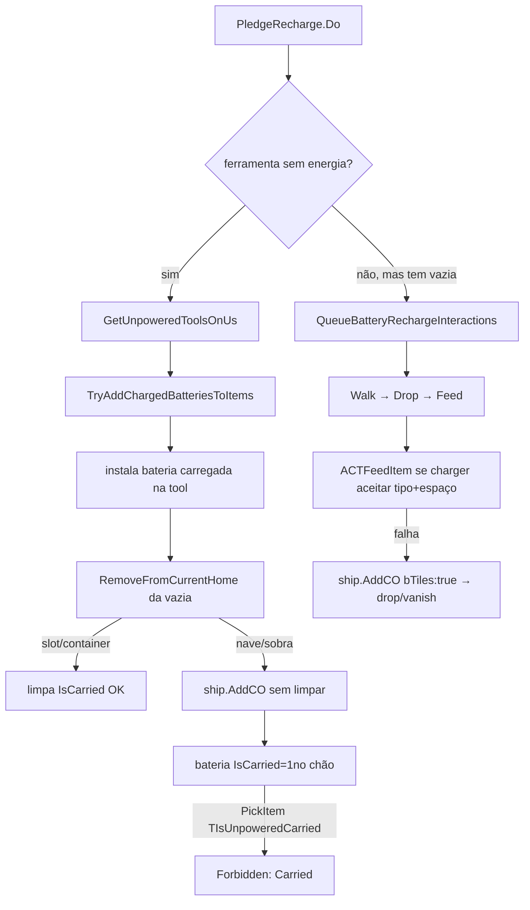

# Ostranauts — Battery System Deep Dive (Mapa Completo do Workflow)

> Complementa `ostranauts-ai-architecture.md` (§5.3, §6) e `ostranauts-modding-quickref.md`.
> Fonte: decompilação da `Assembly-CSharp.dll` (ilspycmd, 612 arquivos em `/tmp/game_api_full/`).
> Linhas referem a esta decompilação. Versão do jogo-alvo: **1.0.0.9**.

Este documento é o mapa **completo do ciclo de vida da bateria** — de como uma bateria é
carregada, passada, trocada, e onde o jogo base comete o bug do "item fantasma /
*Forbidden: Carried*". Serve de referência para qualquer mod/fix de energia.

---

## 1. Vocabulário (condições/triggers reais — só estes existem)

### Condições `Is*` (em `CondOwner`)
| Condição | Significado |
|---|---|
| `IsPowerStorage` | Item guarda energia (bateria). |
| `IsPocketable` | Item que cabe no bolso (handheld). |
| `IsPowerObservable` | Tool/equipamento que consome energia (ferramenta/suit). |
| `IsPowered` | Tem energia agora. |
| `IsChargerEVA` / `IsChargerDrill01` / `IsChargerWelder01` | Marcador de carregador de bateria do tipo X. |
| `IsRechargingContainer` | Container que recarrega o item de dentro. |
| `IsBattery01` / `IsBatteryEVA` / `IsBatteryDrill01` | Tipo específico de bateria (item). |

### Triggers de container `TIs...`
| Trigger | Regra |
|---|---|
| `TIsFitContainerEVABattery` | Requer `IsBatteryEVA`. |
| `TIsFitContainerDrill01Battery` | Requer `IsBatteryDrill01`. |
| `TIsFitContainerBattery04` | Requer `IsBattery04`. |
| `TIsFitContainerWelder01Battery` | Requer `IsBatteryWelder01`. |
| `TIsRechargingContainerOn` | Requer `IsRechargingContainer`; proíbe `IsOff`/`IsDamaged`. |
| `TIsPowerStorageHandheld` | Requer `IsPowerStorage` **e** `IsPocketable`. |
| `TIsUnpoweredPowerObservableNoStorage` | Requer `IsPowerObservable`; proíbe `IsPowerStorage`/`IsPowered`/`IsDamaged`/`IsWorkLamp01`. |

> ⚠️ **Não existem** `TIsSuit`, `TIsBattery` genéricos, `IsPowerSource` como condição de charger
> válida, nem `strRechargeCT` em baterias. Usar esses nomes em mods causa runtime no-op.

---

## 2. Os atores

### 2.1 Baterias (Itens)
- Exemplos: `ItmBattery02` (e b/c/Dmg/Loose), `ItmBattery03`, `ItmBattery04`, `ItmBatteryEVA`,
  `ItmBatteryDrill01`, `ItmBatteryWelder01`, `ItmAmmoPowerCell01`, `ItmBatteryDisp01`.
- Condições comuns: `IsPowerStorage`, `IsPocketable`. Não têm `strRechargeCT` → **não autocarregam**.

### 2.2 Chargers (Itens/condowners instaláveis)
`ItmChargerBattEVA`, `ItmChargerBattDrill01`, `ItmChargerBattWelder01`, `ItmChargerBattery04`.
- `IsRechargingContainer`, `IsChargerX`, `IsPowerStorage`, `IsInstalled`, `IsPowered`,
  `IsRechargingContainer`.
- `strContainerCT` restringe o tipo aceito (via triggers acima).
- Posição física: mapa `PowerA`/`PowerB`; bateria precisa **estar dentro do charger** (não só a bordo).

### 2.3 `Powered` (Powered.cs)
- `Powered.UsePower(cO, fAmount)`: recarrega conteúdo `IsPowerStorage` quando o container tem
  `IsRechargingContainer`.
- `PowerRechargeAmount = (PowerStoredMax − StatPower) × 0.001` (por tick).
- Bateria **solta em tile conectado a power storage** na nave recarrega quando encaixa em `IsRechargingContainer`.

---

## 3. PledgeRecharge (O IA nativo de trocar/recarregar bateria)

Classe: `Ostranauts.Pledges.PledgeRecharge : Pledge2` (`Ostranauts.Pledges/PledgeRecharge.cs`, 569 linhas).
Presente por padrão em toda crew via pledge `AIRechargeBatteries` (nPriority 4).
**Não roda em modo manual** (`IsAIManual`).

### 3.1 Métodos (privados, via reflexão)
| Método | Linha | Papel |
|---|---|---|
| `Do()` | 45 | Pipeline principal; retorna `true` se agir. |
| `FindReplacementBatteryInCharger` | 402 | Bateria ≥95% já no charger. |
| `FindChargerBatteryPair` | 97 | Escolhe (charger, bateria-vazia, replacement). |
| `SortChargers` | 132 | Ordena por `GetWeightedDistance`. |
| `FilterBatteries` | 160 | Separa charged (>2%) vs empty (≤2%, `minBatteryCharge=0.02`). |
| `QueueBatteryRechargeInteractions` | 178 | Enfileira Walk→Drop→Feed (→Equip). |
| `QueueFetchBatteryInteractions` | 217 | Vai buscar replacement no charger. |
| `QueuePickupBattery` | 236 | Pega replacement no ship. |
| `GetUnpoweredToolsOnUs` | 425 | Ferramentas sem energia via `TIsUnpoweredPowerObservableNoStorage`. |
| `TryAddChargedBatteriesToItems` | 448 | Instala bateria carregada em tool sem energia. |
| `GetBatteryChargePercentage` | 559 | `StatPower/StatPowerMax`. |

### 3.2 Pipeline do `Do()` (linhas reais)
```
Do()
 ├ us/ship null ou IsAIManual → return false
 ├ empresa null || !mapRoster[strID].bReplaceBatteries → return false
 ├ FilterBatteries(TIsPowerStorageHandheld)
 ├ _allowedShips = GetAvailableShips; vazio → return false
 ├ se há vazias:
 │   charger esear (GetAllChargers via TIsRechargingContainerOn);
 │   FindChargerBatteryPair (precisa ctAllowed.Triggered(vazia) + CanFit ou ≥0.95 charged dentro)
 │   se achou → QueueBatteryRechargeInteractions(us, charger, vazia, replacement); return true
 ├ ferramentas sem energia?
 │   TryAddChargedBatteriesToItems → true se instalou
 │   senão QueuePickupBattery
 └ return false
```
Ações enfileiradas por `QueueBatteryRechargeInteractions` (cadeia `AddDependent`):
`Walk → DropItem(vazia) → [PickupItem(replacement)] → ACTFeedItem(Goal no charger, strTargetPoint "use", range 1) → [EquipItem]`

---

## 4. ACTFeedItem → give-contract (onde a bateria sumiu)

`Interaction.cs` (decompilado), bloco give ~linha 2695-2730. A mensagem "deliver … to …" e
`STR_ERROR_NOT_INV` ("Bad") vêm daqui.

### 4.1 Passo-a-passo
1. `ship2 = singleOrStack2.RemoveFromCurrentHome()` (linha 2702) — tira a bateria do dono atual.
2. `condOwner4 = objThem.AddCO(singleOrStack2, bEquip, bOverflow:true, bIgnoreLocks:true)` (2713/2722).
   - `objThem` = charger. Se o charger rejeitar (tipo errado, cheio, acesso), retorna a bateria.
3. Se `condOwner4 != null` (falhou):
   - `objThem.LogMessage(STR_ERROR_NO_ROOM_INV, "Bad", …)` (2726)
   - **`ship2?.AddCO(condOwner4, bTiles: true)`** (2727) — cai para o chão/nave.

**Este é o bug:** `Ship.AddCO(…, bTiles:true)` **não limpa `IsEquip`/`IsCarried`**, e o chão
agora tem uma bateria "fantasma".

---

## 5. O bug "Forbidden: Carried" (causa raiz confirmada)

### 5.1 Por que a bateria fica presa
1. `PledgeRecharge.TryAddChargedBatteriesToItems` re-adiciona uma bateria sobrando à nave via
   `ship?.AddCO(…, bTiles:false)` **sem zerar IsCarried/IsSlotted**.
2. `RemoveFromCurrentHome()` (CondOwner.cs:5652):
   - ramo **slot de mão** → `UnSlotItem` → limpa `IsCarried` ✅
   - ramo **container** → `Container.RemoveCO` → `ClearIsInContainer` → limpa `IsCarried` ✅
   - ramo **chão da nave** (Ship.RemoveCO / re-Add via ship.AddCO bTiles) → **NÃO limpa** ❌
3. A interação de pegar `PickleItem` tem trigger `TIsNotCarriedNotInstalled` (forbid `IsCarried`).
   → bateria com `IsCarried=1` no chão é **rejeitada** com `Forbidden: Carried`.

### 5.2 Diagrama Mermaid


---

## 6. Fixes e design (aplicado no `OstBattFix` / BatteryCare)

Os fixes posicionam-se nos **limites reais** que o jogo já opera, não sobreescrevem a IA.

| Hook | Tipo | O que faz | Alinhamento |
|---|---|---|---|
| `CondOwner.DropCO(objCO…)` | Postfix | Ao largar **o item (`objCO`)** no chão, zera `IsCarried/IsSlotted/IsInContainer` no item. | Preenche o gap do Ship.RemoveCO (igual `Container.ClearIsInContainer`). |
| `CondOwner.AddCO(…, bEquip, bOverflow, bIgnoreLocks)` | postfix alta prioridade | Se encaixe em charger falhar (retorna !=null), re-roteia para charger compatível (ctAllowed+CanFit) ou segu-na nave sem drop fantasma. | Intercepta no ponto `AddCO` que o próprio game usa no give-contract. |
| `WorkManager.FailTask` (4-arg) | postfix (diagnóstico) | Loga cada falha de tarefa até confirmar o string de "tool sem energia". | Ponto real onde tarefa fica vermelha. |

> **Anti-fantasma global** (varrer `mapCOs` a cada 3s) é **não-arquitetural** — colei como desuso;
> prefira os hooks por eventos acima.

### 6.1 Sinais de depuração
- `UnityEngine.Debug.Log` → cai em `Player.log` (flush confiável sob Proton).
- `BepInEx/LogOutput.log` é **bufferizado** e só flush no start/exit — não confiar em tempo live.

---

## 7. Referência — arquivos decompilados
| Arquivo | Onde |
|---|---|
| `PledgeRecharge.cs` | `/tmp/game_api_full/Ostranauts.Pledges/PledgeRecharge.cs` |
| `Interaction.cs` (give-contract ~2702-2733) | `/tmp/game_api_full/Interaction.cs` |
| `Powered.cs` | `/tmp/game_api_full/Powered.cs` |
| `CondOwner.cs` (DropCO/RemoveFromHome/AddCO) | `/tmp/game_api_full/CondOwner.cs` |
| `DataHandler.cs` (trimDedução de condição/trigger) | `/tmp/game_api_full/DataHandler.cs` |
| `condtrigs.json` | `Ostranauts_Data/StreamingAssets/data/condtrigs/condtrigs.json` |

---

## 8. Checklist para futuros mods de energia
- [ ] Confirmar nome real da condição/trigger no `condtrigs.json` (nunca inventar).
- [ ] Assinar `AddCO`/`DropCO` exata com o decompilado (possui assinatura com vários overloads).
- [ ] Testar aFlags zero só no `objCO` (item), não no `__instance` (dono).
- [ ] Verificar a carga sob Proton via `Player.log`, não `BepInEx/LogOutput.log`.
- [ ] Preferir eventos (posts/prefix nos limites reais) a pollings padrão.